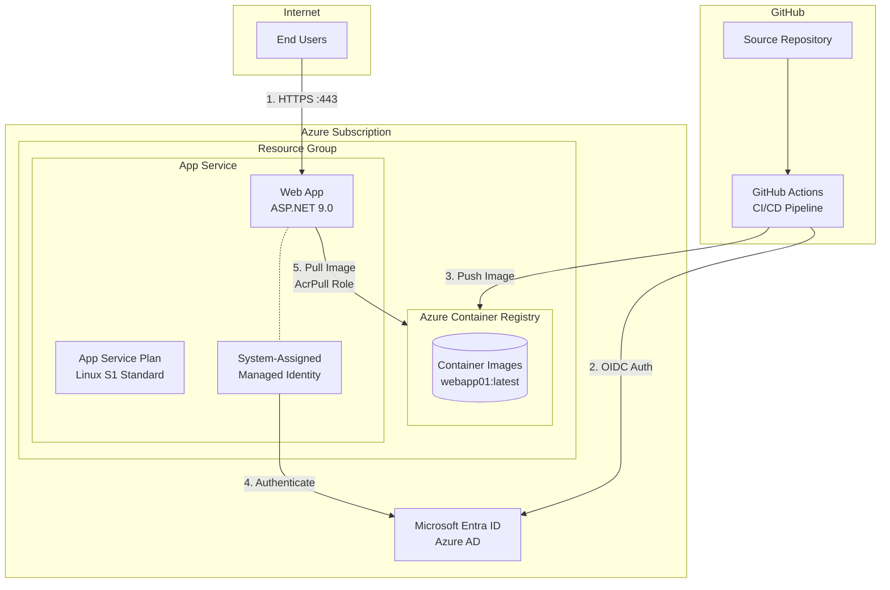
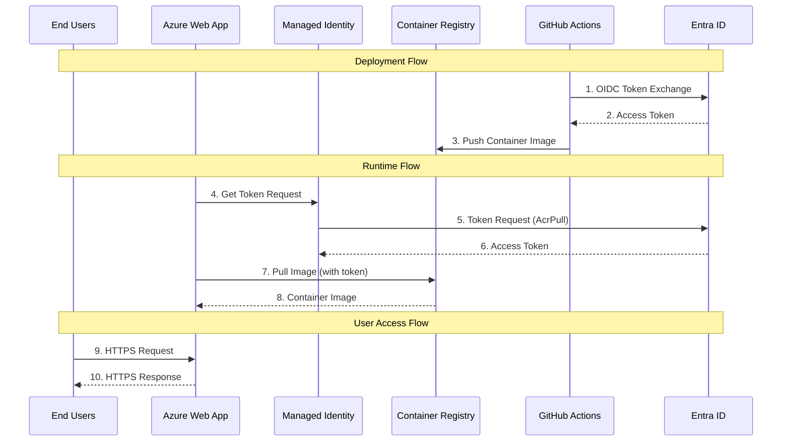

# Security Plan - gh-aspnet-webapp Blueprint

## Preamble

_Important to note:_ This security analysis cannot certify or attest to the complete security of an architecture or code. This document is intended to help produce security-focused backlog items and document relevant security design decisions.

**Document Version:** 2.0  
**Created:** February 10, 2026  
**Blueprint:** gh-aspnet-webapp  
**Status:** Fresh Threat Model

## Overview

The gh-aspnet-webapp blueprint deploys a containerized ASP.NET 9.0 Razor Pages web application to Azure App Service using Azure Container Registry (ACR) with managed identity authentication. This architecture demonstrates cloud-native DevSecOps practices with credential-less authentication and container-based deployment.

**Key Security Features:**
- System-assigned managed identity eliminates stored credentials
- AcrPull RBAC role enforces least-privilege access
- ACR admin user disabled by default
- GitHub Actions OIDC federation for CI/CD
- HTTPS-only communication enforced

**Architecture Pattern:** Cloud-native containerized web application with PaaS deployment

## Diagrams

### Architecture Diagram



### Data Flow Diagram



### Data Flow Attributes

| # | Source | Destination | Transport Protocol | Data Classification | Authentication | Authorization | Notes |
|---|--------|-------------|-------------------|---------------------|----------------|---------------|-------|
| 1 | GitHub Actions | Entra ID | HTTPS/TLS 1.2+ | Internal | OIDC JWT Token | Federated Identity | Workload identity federation |
| 2 | Entra ID | GitHub Actions | HTTPS/TLS 1.2+ | Internal | N/A | N/A | OAuth 2.0 access token |
| 3 | GitHub Actions | ACR | HTTPS/TLS 1.2+ | Internal | Bearer Token | AcrPush Role | Container image push |
| 4 | Web App | Managed Identity | Internal API | Internal | System Identity | N/A | Azure IMDS endpoint |
| 5 | Managed Identity | Entra ID | HTTPS/TLS 1.2+ | Internal | Certificate | N/A | Token acquisition |
| 6 | Entra ID | Managed Identity | HTTPS/TLS 1.2+ | Internal | N/A | N/A | OAuth 2.0 token |
| 7 | Web App | ACR | HTTPS/TLS 1.2+ | Internal | Bearer Token | AcrPull Role | Image pull operation |
| 8 | ACR | Web App | HTTPS/TLS 1.2+ | Internal | N/A | N/A | Container image layers |
| 9 | End Users | Web App | HTTPS/TLS 1.2+ | Public/Confidential | None/App-level | None/App-level | User requests |
| 10 | Web App | End Users | HTTPS/TLS 1.2+ | Public/Confidential | N/A | N/A | Application responses |

## Secrets Inventory

| Name | Purpose | Storage Location | Generation Method | Rotation Strategy | Distribution Method | Lifespan | Environment |
|------|---------|------------------|-------------------|-------------------|---------------------|----------|-------------|
| Managed Identity Certificate | ACR authentication | Azure platform (HSM) | Azure-managed | Automatic (Azure) | Azure IMDS | Short-lived (hours) | Production |
| OIDC JWT Token | CI/CD authentication | GitHub Actions runtime | GitHub-generated | Per workflow run | Ephemeral in memory | Minutes | CI/CD |
| ACR Access Token | Image pull authorization | Memory only | Entra ID | Per request | Managed Identity | 1 hour | Runtime |
| STORAGE_TEST | **CRITICAL: Exposed secret** | appsettings.json | Unknown | **None** | Version control | **Indefinite** | All |
| CUSTOM_TEST | **CRITICAL: Exposed token** | appsettings.json | Unknown | **None** | Version control | **Indefinite** | All |
| App Service Config | Runtime configuration | App Service platform | Manual/IaC | Manual | Platform API | Static | Production |

### ⚠️ CRITICAL SECURITY FINDING

**Hardcoded secrets detected in `src/webapp01/appsettings.json`:**
- `STORAGE_TEST`: Storage account key exposed
- `CUSTOM_TEST`: GitHub token exposed

**Immediate Action Required:**
1. Revoke exposed credentials immediately
2. Remove from source code and commit history
3. Implement Azure Key Vault integration
4. Enable secret scanning in GitHub Advanced Security

## Threats and Mitigations

Risk Legend:
* 🔴 **Critical** - Immediate remediation required
* 🟠 **High** - Remediate within 30 days
* 🟡 **Medium** - Remediate within 90 days
* 🟢 **Low** - Remediate as resources allow
* ✅ **Mitigated** - Controls in place

| Threat # | Category | Affected Asset | Threat Description | Status | Risk |
|----------|----------|----------------|-------------------|--------|------|
| [T1](#threat-t1) | Data Protection (DP) | appsettings.json | Hardcoded secrets in source code | ⚠️ Exposed | 🔴 Critical |
| [T2](#threat-t2) | DevOps Security (DS) | Container Images | Unsigned container images enable tampering | ⚠️ Not Mitigated | 🟠 High |
| [T3](#threat-t3) | DevOps Security (DS) | Dependencies | Vulnerable dependencies in supply chain | ⚠️ Partial | 🟠 High |
| [T4](#threat-t4) | Network Security (NS) | Web App | Missing security headers expose to attacks | ⚠️ Not Mitigated | 🟠 High |
| [T5](#threat-t5) | Privileged Access (PA) | ACR | Unauthorized container registry access | ✅ Partially | 🟡 Medium |
| [T6](#threat-t6) | Application Security | Web App Code | Web application vulnerabilities (OWASP) | ⚠️ Not Scanned | 🟠 High |
| [T7](#threat-t7) | Endpoint Security (ES) | Container Runtime | Container escape vulnerabilities | ⚠️ Partial | 🟡 Medium |
| [T8](#threat-t8) | Network Security (NS) | Web App | Denial of service attacks | ⚠️ Basic Only | 🟡 Medium |
| [T9](#threat-t9) | Data Protection (DP) | Error Pages | Information disclosure via error messages | ⚠️ Partial | 🟡 Medium |
| [T10](#threat-t10) | Governance (GS) | All Components | Insufficient security logging and monitoring | ⚠️ Not Configured | 🟡 Medium |
| [T11](#threat-t11) | Identity Management (IM) | Managed Identity | Managed identity compromise | ✅ Mitigated | 🟢 Low |
| [T12](#threat-t12) | DevOps Security (DS) | CI/CD Pipeline | GitHub Actions workflow vulnerabilities | ⚠️ Partial | 🟡 Medium |

## Detailed Threats and Mitigations

### Threat T1

**Principle:** Confidentiality  
**Affected Asset:** src/webapp01/appsettings.json  
**Threat:** Hardcoded Secrets in Source Code

**Description:** 
The application configuration file contains hardcoded secrets including what appears to be an Azure Storage account key (`STORAGE_TEST`) and a GitHub token (`CUSTOM_TEST`). These secrets are committed to version control, making them accessible to anyone with repository access and permanently stored in Git history.

**STRIDE Classification:** Information Disclosure  
**CWE:** CWE-798 (Use of Hard-coded Credentials)  
**Current Status:** 🔴 Active vulnerability - credentials exposed in repository

**Recommended Mitigations:**

1. **IMMEDIATE** - Revoke compromised credentials
   ```bash
   # Rotate Azure Storage account key
   az storage account keys renew --account-name <storage-account> --key primary
   
   # Revoke GitHub token
   # Navigate to GitHub Settings > Developer settings > Personal access tokens
   ```

2. **IMMEDIATE** - Remove secrets from source code
   ```bash
   # Remove from current files
   # Edit appsettings.json to remove STORAGE_TEST and CUSTOM_TEST
   
   # Remove from Git history
   git filter-branch --force --index-filter \
     "git rm --cached --ignore-unmatch src/webapp01/appsettings.json" \
     --prune-empty --tag-name-filter cat -- --all
   ```

3. **HIGH PRIORITY** - Implement Azure Key Vault integration
   ```bicep
   // Add to resources.bicep
   resource keyVault 'Microsoft.KeyVault/vaults@2023-02-01' = {
     name: 'kv-${webAppName}'
     location: location
     properties: {
       sku: { family: 'A', name: 'standard' }
       tenantId: subscription().tenantId
       enableRbacAuthorization: true
       enabledForDeployment: false
       enabledForTemplateDeployment: true
     }
   }
   
   // Grant Web App access to Key Vault
   resource kvRoleAssignment 'Microsoft.Authorization/roleAssignments@2022-04-01' = {
     scope: keyVault
     name: guid(keyVault.id, webApp.id, 'KeyVaultSecretsUser')
     properties: {
       roleDefinitionId: subscriptionResourceId('Microsoft.Authorization/roleDefinitions', 
         '4633458b-17de-408a-b874-0445c86b69e6') // Key Vault Secrets User
       principalId: webApp.identity.principalId
       principalType: 'ServicePrincipal'
     }
   }
   ```

4. **HIGH PRIORITY** - Update application to use Key Vault references
   ```csharp
   // Program.cs
   builder.Configuration.AddAzureKeyVault(
     new Uri($"https://{builder.Configuration["KeyVaultName"]}.vault.azure.net/"),
     new DefaultAzureCredential());
   ```

5. **ONGOING** - Enable GitHub secret scanning
   ```yaml
   # Enable in repository settings:
   # Settings > Security > Code security and analysis
   # - Enable secret scanning
   # - Enable push protection
   ```

**Cloud Platform Guidance (Azure):**
- Use Azure Key Vault for all secrets, keys, and certificates
- Implement Key Vault firewall to restrict access to Azure services only
- Enable soft delete and purge protection on Key Vault
- Use managed identities for Key Vault authentication (no credentials needed)
- Store connection strings, API keys, and certificates in Key Vault
- Reference secrets using Key Vault references in App Service configuration: `@Microsoft.KeyVault(SecretUri=...)`

---

### Threat T2

**Principle:** Integrity  
**Affected Asset:** Azure Container Registry, Container Images  
**Threat:** Unsigned Container Images Enable Tampering

**Description:**
Container images are not signed or verified during the CI/CD pipeline or deployment process. An attacker who compromises the CI/CD pipeline or gains push access to ACR could inject malicious code into container images, which would then be deployed to production without detection.

**STRIDE Classification:** Tampering  
**CWE:** CWE-345 (Insufficient Verification of Data Authenticity)  
**Current Status:** ⚠️ No signing mechanism implemented

**Recommended Mitigations:**

1. **HIGH PRIORITY** - Implement container image signing with Notation
   ```yaml
   # Add to .github/workflows/cicd.yml
   - name: Sign container image
     uses: notaryproject/notation-action@v1
     with:
       plugin_name: 'azure-kv'
       plugin_url: 'https://github.com/Azure/notation-azure-kv/releases'
       key_id: ${{ secrets.SIGNING_KEY_ID }}
       target_artifact_reference: ${{ env.ACR_LOGIN_SERVER }}/webapp01:${{ github.sha }}
   ```

2. **HIGH PRIORITY** - Enable ACR Content Trust
   ```bash
   az acr config content-trust update \
     --name <acr-name> \
     --status enabled
   ```

3. **MEDIUM PRIORITY** - Implement image vulnerability scanning
   ```bash
   # Enable Microsoft Defender for Containers
   az security pricing create \
     --name Containers \
     --tier Standard
   ```

4. **MEDIUM PRIORITY** - Pin images by digest in deployment
   ```bicep
   // Update linuxFxVersion to use digest
   linuxFxVersion: 'DOCKER|${acr.properties.loginServer}/${containerImageName}@sha256:...'
   ```

5. **LOW PRIORITY** - Implement admission control policies
   ```bash
   # Configure App Service to only allow signed images
   az webapp config set --name <webapp-name> \
     --resource-group <rg-name> \
     --generic-configurations '{"allowOnlySignedImages": true}'
   ```

**Cloud Platform Guidance (Azure):**
- Use Azure Key Vault to store signing certificates
- Integrate with Microsoft Defender for Containers for vulnerability scanning
- Enable ACR quarantine policy to prevent deployment of vulnerable images
- Use Azure Policy to enforce container image signing requirements
- Implement Azure Container Registry Tasks for automated scanning on push

---

### Threat T3

**Principle:** Integrity  
**Affected Asset:** NuGet Dependencies, Docker Base Images  
**Threat:** Vulnerable Dependencies in Supply Chain

**Description:**
The application and container base images may contain vulnerable dependencies (NuGet packages, OS packages) that could be exploited by attackers. Without automated dependency scanning and updates, vulnerable dependencies remain in production indefinitely.

**STRIDE Classification:** Tampering  
**CWE:** CWE-1104 (Use of Unmaintained Third Party Components)  
**Current Status:** ⚠️ Dependabot not configured, no automated scanning

**Recommended Mitigations:**

1. **HIGH PRIORITY** - Enable Dependabot for dependency updates
   ```yaml
   # Create .github/dependabot.yml
   version: 2
   updates:
     - package-ecosystem: "nuget"
       directory: "/src/webapp01"
       schedule:
         interval: "weekly"
       open-pull-requests-limit: 10
       
     - package-ecosystem: "docker"
       directory: "/src/webapp01"
       schedule:
         interval: "weekly"
       
     - package-ecosystem: "github-actions"
       directory: "/"
       schedule:
         interval: "weekly"
   ```

2. **HIGH PRIORITY** - Enable GitHub Advanced Security dependency scanning
   ```bash
   # Enable in repository settings
   # Settings > Security > Dependency graph > Dependency scanning
   ```

3. **MEDIUM PRIORITY** - Pin dependency versions
   ```xml
   <!-- webapp01.csproj - use specific versions -->
   <PackageReference Include="Microsoft.AspNetCore.App" Version="9.0.0" />
   ```

4. **MEDIUM PRIORITY** - Generate and attest SBOM
   ```yaml
   # Add to CI/CD workflow
   - name: Generate SBOM
     uses: anchore/sbom-action@v0
     with:
       format: cyclonedx-json
       output-file: sbom.json
       
   - name: Attest SBOM
     uses: actions/attest-sbom@v1
     with:
       subject-path: 'docker-archive:webapp01.tar'
       sbom-path: sbom.json
   ```

5. **ONGOING** - Regular base image updates
   ```dockerfile
   # Pin to specific digest but update regularly
   FROM mcr.microsoft.com/dotnet/aspnet:9.0@sha256:abc123...
   ```

**Cloud Platform Guidance (Azure):**
- Integrate with Microsoft Defender for DevOps for comprehensive scanning
- Use Azure Container Registry Tasks to scan images on every commit
- Enable Azure Advisor recommendations for security updates
- Implement Azure Policy to require updated base images
- Use Azure DevOps Artifacts for approved package sources only

---

### Threat T4

**Principle:** Confidentiality, Integrity  
**Affected Asset:** Web Application HTTP Responses  
**Threat:** Missing Security Headers Expose Application to Attacks

**Description:**
The web application does not implement security headers, making it vulnerable to clickjacking (no X-Frame-Options), MIME-sniffing attacks (no X-Content-Type-Options), XSS (no Content-Security-Policy), and other browser-based attacks.

**STRIDE Classification:** Information Disclosure, Tampering  
**CWE:** CWE-1021 (Improper Restriction of Rendered UI Layers)  
**Current Status:** ⚠️ Only HSTS enabled by default

**Recommended Mitigations:**

1. **HIGH PRIORITY** - Add security headers middleware
   ```csharp
   // Add to Program.cs after app.UseHsts()
   app.Use(async (context, next) =>
   {
       // Prevent clickjacking
       context.Response.Headers.Append("X-Frame-Options", "DENY");
       
       // Prevent MIME-sniffing
       context.Response.Headers.Append("X-Content-Type-Options", "nosniff");
       
       // Content Security Policy
       context.Response.Headers.Append("Content-Security-Policy", 
           "default-src 'self'; script-src 'self'; style-src 'self' 'unsafe-inline'; img-src 'self' data:;");
       
       // Referrer Policy
       context.Response.Headers.Append("Referrer-Policy", "strict-origin-when-cross-origin");
       
       // Permissions Policy
       context.Response.Headers.Append("Permissions-Policy", 
           "geolocation=(), microphone=(), camera=()");
       
       await next();
   });
   ```

2. **MEDIUM PRIORITY** - Configure HSTS with appropriate settings
   ```csharp
   // Update HSTS configuration in Program.cs
   app.UseHsts(hsts => hsts
       .MaxAge(days: 365)
       .IncludeSubdomains()
       .Preload());
   ```

3. **MEDIUM PRIORITY** - Implement Subresource Integrity (SRI)
   ```html
   <!-- For external resources, use SRI -->
   <script src="https://cdn.example.com/lib.js" 
           integrity="sha384-..." 
           crossorigin="anonymous"></script>
   ```

4. **LOW PRIORITY** - Add security.txt file
   ```
   # Create wwwroot/.well-known/security.txt
   Contact: mailto:security@example.com
   Expires: 2027-02-10T00:00:00.000Z
   Preferred-Languages: en
   ```

**Cloud Platform Guidance (Azure):**
- Configure security headers at Azure Front Door or Application Gateway level
- Use Azure Web Application Firewall (WAF) for additional protection
- Enable Azure App Service custom headers in portal or via Bicep
- Test headers using Azure Security Center recommendations

---

### Threat T5

**Principle:** Confidentiality, Integrity  
**Affected Asset:** Azure Container Registry  
**Threat:** Unauthorized Container Registry Access

**Description:**
While managed identity and disabled admin user provide good baseline security, ACR is accessible from the internet without network restrictions. An attacker who compromises a credential with push access could deploy malicious containers.

**STRIDE Classification:** Elevation of Privilege  
**CWE:** CWE-284 (Improper Access Control)  
**Current Status:** ✅ Admin disabled, managed identity used, but network unrestricted

**Recommended Mitigations:**

1. **MEDIUM PRIORITY** - Implement ACR firewall rules
   ```bicep
   // Add to resources.bicep
   resource acr 'Microsoft.ContainerRegistry/registries@2023-01-01-preview' = {
     name: acrName
     properties: {
       adminUserEnabled: false
       networkRuleSet: {
         defaultAction: 'Deny'
         ipRules: [
           {
             action: 'Allow'
             value: '0.0.0.0/0' // GitHub Actions IPs - replace with specific ranges
           }
         ]
       }
       publicNetworkAccess: 'Enabled'
     }
   }
   ```

2. **MEDIUM PRIORITY** - Enable diagnostic logging
   ```bicep
   resource acrDiagnostics 'Microsoft.Insights/diagnosticSettings@2021-05-01-preview' = {
     name: 'acr-diagnostics'
     scope: acr
     properties: {
       logs: [
         {
           category: 'ContainerRegistryRepositoryEvents'
           enabled: true
         }
         {
           category: 'ContainerRegistryLoginEvents'
           enabled: true
         }
       ]
       metrics: [
         {
           category: 'AllMetrics'
           enabled: true
         }
       ]
     }
   }
   ```

3. **LOW PRIORITY** - Upgrade to Premium SKU for private endpoints
   ```bicep
   // For production environments
   sku: {
     name: 'Premium'
   }
   
   // Then add private endpoint
   resource acrPrivateEndpoint 'Microsoft.Network/privateEndpoints@2023-04-01' = {
     name: 'pe-${acrName}'
     location: location
     properties: {
       subnet: {
         id: subnetId
       }
       privateLinkServiceConnections: [
         {
           name: 'acr-connection'
           properties: {
             privateLinkServiceId: acr.id
             groupIds: ['registry']
           }
         }
       ]
     }
   }
   ```

4. **ONGOING** - Monitor ACR access patterns
   ```bash
   # Set up alerts for suspicious activity
   az monitor metrics alert create \
     --name acr-unusual-access \
     --resource <acr-resource-id> \
     --condition "count ContainerRegistryLoginEvents > 100" \
     --window-size 5m
   ```

**Cloud Platform Guidance (Azure):**
- Use Azure Private Link for ACR access from App Service
- Implement Conditional Access policies for ACR access
- Enable Azure Defender for Container Registries
- Use Azure RBAC with fine-grained permissions
- Implement repository-level permissions for multi-tenant scenarios

---

### Threat T6

**Principle:** Confidentiality, Integrity, Availability  
**Affected Asset:** ASP.NET Web Application Code  
**Threat:** Web Application Vulnerabilities (OWASP Top 10)

**Description:**
The web application may contain common vulnerabilities such as injection flaws, broken authentication, XSS, CSRF, security misconfiguration, and other OWASP Top 10 issues. No static application security testing (SAST) is currently implemented.

**STRIDE Classification:** Multiple (Spoofing, Tampering, Information Disclosure, Elevation of Privilege)  
**CWE:** Multiple (CWE-79 XSS, CWE-89 SQL Injection, CWE-352 CSRF, etc.)  
**Current Status:** ⚠️ No SAST scanning configured

**Recommended Mitigations:**

1. **HIGH PRIORITY** - Enable CodeQL scanning
   ```yaml
   # Create .github/workflows/codeql.yml
   name: "CodeQL"
   on:
     push:
       branches: [ main ]
     pull_request:
       branches: [ main ]
     schedule:
       - cron: '0 0 * * 0'
   
   jobs:
     analyze:
       name: Analyze
       runs-on: ubuntu-latest
       permissions:
         actions: read
         contents: read
         security-events: write
       steps:
         - uses: actions/checkout@v4
         - uses: github/codeql-action/init@v3
           with:
             languages: csharp
         - uses: github/codeql-action/autobuild@v3
         - uses: github/codeql-action/analyze@v3
   ```

2. **HIGH PRIORITY** - Implement anti-forgery token validation
   ```csharp
   // Add to Program.cs
   builder.Services.AddAntiforgery(options =>
   {
       options.HeaderName = "X-CSRF-TOKEN";
       options.Cookie.SecurePolicy = CookieSecurePolicy.Always;
       options.Cookie.SameSite = SameSiteMode.Strict;
   });
   
   // In Razor Pages
   @inject Microsoft.AspNetCore.Antiforgery.IAntiforgery Antiforgery
   @{
       var token = Antiforgery.GetAndStoreTokens(Context);
   }
   <input type="hidden" name="__RequestVerificationToken" value="@token.RequestToken" />
   ```

3. **MEDIUM PRIORITY** - Implement input validation
   ```csharp
   // Use Data Annotations
   public class ContactModel
   {
       [Required]
       [StringLength(100, MinimumLength = 2)]
       [RegularExpression(@"^[a-zA-Z\s]+$")]
       public string Name { get; set; }
       
       [Required]
       [EmailAddress]
       public string Email { get; set; }
   }
   ```

4. **MEDIUM PRIORITY** - Configure secure cookie settings
   ```csharp
   builder.Services.ConfigureApplicationCookie(options =>
   {
       options.Cookie.HttpOnly = true;
       options.Cookie.SecurePolicy = CookieSecurePolicy.Always;
       options.Cookie.SameSite = SameSiteMode.Strict;
       options.ExpireTimeSpan = TimeSpan.FromHours(1);
       options.SlidingExpiration = true;
   });
   ```

5. **ONGOING** - Regular security testing
   - SAST: CodeQL in CI/CD
   - DAST: OWASP ZAP scanning
   - SCA: Dependabot and GitHub Advanced Security
   - Manual: Periodic penetration testing

**Cloud Platform Guidance (Azure):**
- Use Azure Application Insights for security event logging
- Enable Azure Web Application Firewall (WAF) for additional protection
- Implement Azure Front Door with WAF for DDoS and OWASP Top 10 protection
- Use Azure Security Center recommendations for web apps

---

### Threat T7

**Principle:** Confidentiality, Integrity, Availability  
**Affected Asset:** Container Runtime Environment  
**Threat:** Container Escape Vulnerabilities

**Description:**
The container runs as root user, increasing the risk that a container escape vulnerability could provide an attacker with host-level access. While App Service provides managed container isolation, defense-in-depth requires non-root execution.

**STRIDE Classification:** Elevation of Privilege  
**CWE:** CWE-250 (Execution with Unnecessary Privileges)  
**Current Status:** ⚠️ Container runs as root

**Recommended Mitigations:**

1. **MEDIUM PRIORITY** - Run container as non-root user
   ```dockerfile
   # Update Dockerfile final stage
   FROM base AS final
   WORKDIR /app
   
   # Create non-root user
   RUN adduser --disabled-password --gecos '' --uid 1001 appuser && \
       chown -R appuser:appuser /app
   
   COPY --from=publish --chown=appuser:appuser /app/publish .
   
   # Switch to non-root user
   USER appuser
   
   ENTRYPOINT ["dotnet", "webapp01.dll"]
   ```

2. **MEDIUM PRIORITY** - Use minimal base images
   ```dockerfile
   # Consider using distroless or runtime-deps
   FROM mcr.microsoft.com/dotnet/runtime-deps:9.0-alpine AS base
   ```

3. **MEDIUM PRIORITY** - Implement read-only filesystem where possible
   ```dockerfile
   # App Service doesn't support --read-only flag, but minimize writable paths
   VOLUME ["/tmp"]
   ```

4. **LOW PRIORITY** - Regular base image updates
   ```bash
   # Pin to specific digest in Dockerfile
   FROM mcr.microsoft.com/dotnet/aspnet:9.0@sha256:abc123def456...
   
   # Update regularly (monthly)
   ```

5. **ONGOING** - Container vulnerability scanning
   ```yaml
   # Add to CI/CD workflow
   - name: Run Trivy vulnerability scanner
     uses: aquasecurity/trivy-action@master
     with:
       image-ref: ${{ env.ACR_LOGIN_SERVER }}/webapp01:${{ github.sha }}
       format: 'sarif'
       output: 'trivy-results.sarif'
       
   - name: Upload Trivy results to GitHub Security
     uses: github/codeql-action/upload-sarif@v3
     with:
       sarif_file: 'trivy-results.sarif'
   ```

**Cloud Platform Guidance (Azure):**
- App Service provides managed container isolation with hypervisor-level security
- Use Azure Policy to enforce non-root container requirements
- Enable Microsoft Defender for Containers for runtime protection
- Implement Azure Security Center recommendations for containers

---

### Threat T8

**Principle:** Availability  
**Affected Asset:** Azure Web App  
**Threat:** Denial of Service Attacks

**Description:**
The application lacks rate limiting and request size restrictions, making it vulnerable to DoS attacks where an attacker floods the service with requests or sends oversized payloads to exhaust resources.

**STRIDE Classification:** Denial of Service  
**CWE:** CWE-770 (Allocation of Resources Without Limits)  
**Current Status:** ⚠️ App Service provides basic DDoS protection only

**Recommended Mitigations:**

1. **MEDIUM PRIORITY** - Implement rate limiting middleware
   ```csharp
   // Add NuGet package: AspNetCoreRateLimit
   builder.Services.AddMemoryCache();
   builder.Services.AddInMemoryRateLimiting();
   builder.Services.Configure<IpRateLimitOptions>(options =>
   {
       options.GeneralRules = new List<RateLimitRule>
       {
           new RateLimitRule
           {
               Endpoint = "*",
               Period = "1m",
               Limit = 100
           }
       };
   });
   ```

2. **MEDIUM PRIORITY** - Configure request size limits
   ```csharp
   // Program.cs
   builder.Services.Configure<IISServerOptions>(options =>
   {
       options.MaxRequestBodySize = 10 * 1024 * 1024; // 10 MB
   });
   
   builder.Services.Configure<KestrelServerOptions>(options =>
   {
       options.Limits.MaxRequestBodySize = 10 * 1024 * 1024; // 10 MB
       options.Limits.MaxConcurrentConnections = 100;
       options.Limits.MaxConcurrentUpgradedConnections = 100;
   });
   ```

3. **LOW PRIORITY** - Deploy Azure Front Door with WAF
   ```bicep
   resource frontDoor 'Microsoft.Cdn/profiles@2021-06-01' = {
     name: 'fd-webapp01'
     location: 'global'
     sku: {
       name: 'Premium_AzureFrontDoor'
     }
   }
   
   resource wafPolicy 'Microsoft.Network/FrontDoorWebApplicationFirewallPolicies@2022-05-01' = {
     name: 'waf-webapp01'
     location: 'global'
     properties: {
       policySettings: {
         enabledState: 'Enabled'
         mode: 'Prevention'
       }
       managedRules: {
         managedRuleSets: [
           {
             ruleSetType: 'Microsoft_DefaultRuleSet'
             ruleSetVersion: '2.1'
           }
         ]
       }
     }
   }
   ```

4. **LOW PRIORITY** - Enable auto-scaling
   ```bicep
   resource autoScaleSettings 'Microsoft.Insights/autoscaleSettings@2022-10-01' = {
     name: 'autoscale-webapp01'
     location: location
     properties: {
       profiles: [
         {
           name: 'Auto scale condition'
           capacity: {
             minimum: '1'
             maximum: '10'
             default: '1'
           }
           rules: [
             {
               metricTrigger: {
                 metricName: 'CpuPercentage'
                 operator: 'GreaterThan'
                 threshold: 70
                 timeAggregation: 'Average'
                 timeWindow: 'PT5M'
               }
               scaleAction: {
                 direction: 'Increase'
                 type: 'ChangeCount'
                 value: '1'
                 cooldown: 'PT5M'
               }
             }
           ]
         }
       ]
       targetResourceUri: appServicePlan.id
     }
   }
   ```

**Cloud Platform Guidance (Azure):**
- Azure App Service includes basic DDoS protection
- Use Azure Front Door Premium for advanced DDoS and WAF protection
- Implement Azure Application Gateway with WAF for regional deployments
- Configure Azure Monitor alerts for unusual traffic patterns

---

### Threat T9

**Principle:** Confidentiality  
**Affected Asset:** Error Pages, Exception Handling  
**Threat:** Information Disclosure via Error Messages

**Description:**
Detailed error messages or stack traces exposed to users could reveal sensitive information about the application's internal structure, file paths, database schema, or installed versions, aiding attackers in reconnaissance.

**STRIDE Classification:** Information Disclosure  
**CWE:** CWE-209 (Generation of Error Message Containing Sensitive Information)  
**Current Status:** ⚠️ Custom error page configured, but may expose request ID

**Recommended Mitigations:**

1. **MEDIUM PRIORITY** - Configure exception handling properly
   ```csharp
   // Program.cs - already implemented but verify
   if (!app.Environment.IsDevelopment())
   {
       app.UseExceptionHandler("/Error");
       app.UseHsts();
   }
   else
   {
       app.UseDeveloperExceptionPage(); // Only in development
   }
   ```

2. **MEDIUM PRIORITY** - Sanitize error responses
   ```csharp
   // Create custom exception handler
   app.UseExceptionHandler(errorApp =>
   {
       errorApp.Run(async context =>
       {
           context.Response.StatusCode = 500;
           context.Response.ContentType = "text/html";
           
           var exceptionHandlerPathFeature = 
               context.Features.Get<IExceptionHandlerPathFeature>();
           
           // Log detailed error server-side
           var logger = context.RequestServices.GetRequiredService<ILogger<Program>>();
           logger.LogError(exceptionHandlerPathFeature?.Error, 
               "Unhandled exception occurred");
           
           // Return generic message to client
           await context.Response.WriteAsync(
               "<h1>An error occurred</h1><p>Please contact support.</p>");
       });
   });
   ```

3. **MEDIUM PRIORITY** - Configure Application Insights
   ```csharp
   // Add Application Insights
   builder.Services.AddApplicationInsightsTelemetry();
   
   // Configure telemetry to exclude sensitive data
   builder.Services.AddSingleton<ITelemetryInitializer, CustomTelemetryInitializer>();
   ```

4. **LOW PRIORITY** - Remove diagnostic headers
   ```csharp
   // Remove server header
   builder.WebHost.ConfigureKestrel(serverOptions =>
   {
       serverOptions.AddServerHeader = false;
   });
   ```

**Cloud Platform Guidance (Azure):**
- Use Azure Application Insights for centralized error logging
- Configure App Service to suppress detailed errors in production
- Enable Azure Monitor for alerting on error patterns
- Use Azure Key Vault for storing connection strings to avoid exposure in logs

---

### Threat T10

**Principle:** Non-Repudiation, Detection  
**Affected Asset:** All Components  
**Threat:** Insufficient Security Logging and Monitoring

**Description:**
Without comprehensive logging and monitoring, security incidents may go undetected, and forensic analysis becomes difficult or impossible. The current configuration lacks centralized logging, security event monitoring, and alerting capabilities.

**STRIDE Classification:** Repudiation  
**CWE:** CWE-778 (Insufficient Logging)  
**Current Status:** ⚠️ No Application Insights or diagnostic logging configured

**Recommended Mitigations:**

1. **HIGH PRIORITY** - Enable Application Insights
   ```bicep
   // Add to resources.bicep
   resource appInsights 'Microsoft.Insights/components@2020-02-02' = {
     name: 'appi-${webAppName}'
     location: location
     kind: 'web'
     properties: {
       Application_Type: 'web'
       RetentionInDays: 90
       publicNetworkAccessForIngestion: 'Enabled'
       publicNetworkAccessForQuery: 'Enabled'
     }
   }
   
   // Add to Web App app settings
   {
     name: 'APPLICATIONINSIGHTS_CONNECTION_STRING'
     value: appInsights.properties.ConnectionString
   }
   ```

2. **HIGH PRIORITY** - Configure diagnostic settings for ACR
   ```bicep
   resource acrDiagnostics 'Microsoft.Insights/diagnosticSettings@2021-05-01-preview' = {
     name: 'acr-diagnostics'
     scope: acr
     properties: {
       workspaceId: logAnalyticsWorkspace.id
       logs: [
         {
           category: 'ContainerRegistryRepositoryEvents'
           enabled: true
           retentionPolicy: {
             enabled: true
             days: 90
           }
         }
         {
           category: 'ContainerRegistryLoginEvents'
           enabled: true
           retentionPolicy: {
             enabled: true
             days: 90
           }
         }
       ]
     }
   }
   ```

3. **MEDIUM PRIORITY** - Implement structured logging
   ```csharp
   // Program.cs
   builder.Services.AddLogging(logging =>
   {
       logging.AddApplicationInsights();
       logging.AddFilter<ApplicationInsightsLoggerProvider>("", LogLevel.Information);
   });
   
   // Usage in code
   logger.LogInformation("User {UserId} accessed {Resource}", userId, resource);
   logger.LogWarning("Failed login attempt for {Username} from {IpAddress}", username, ip);
   ```

4. **MEDIUM PRIORITY** - Configure security alerts
   ```bash
   # Create alert for suspicious ACR access
   az monitor metrics alert create \
     --name "acr-unusual-activity" \
     --resource-group <rg-name> \
     --scopes <acr-resource-id> \
     --condition "count ContainerRegistryLoginEvents where resultType == 'Failure' > 5" \
     --window-size 5m \
     --evaluation-frequency 1m
   ```

5. **ONGOING** - Define logging requirements
   - Authentication events (success/failure)
   - Authorization failures
   - Input validation failures
   - Application errors and exceptions
   - Container image pulls and pushes
   - Configuration changes

**Cloud Platform Guidance (Azure):**
- Use Azure Log Analytics workspace for centralized logging
- Configure Azure Monitor workbooks for security dashboards
- Enable Azure Defender for App Service for threat detection
- Implement Azure Sentinel for SIEM capabilities
- Use Azure Activity Log for control plane audit trail

---

### Threat T11

**Principle:** Authentication, Authorization  
**Affected Asset:** System-Assigned Managed Identity  
**Threat:** Managed Identity Compromise

**Description:**
If an attacker gains code execution within the Web App container, they could potentially abuse the managed identity to access Azure resources beyond the intended scope. However, current RBAC configuration limits exposure to ACR read-only access.

**STRIDE Classification:** Elevation of Privilege  
**CWE:** CWE-269 (Improper Privilege Management)  
**Current Status:** ✅ Properly configured with least-privilege (AcrPull only)

**Recommended Mitigations:**

1. **CURRENT CONTROL** - Least-privilege RBAC ✅
   ```bicep
   // Already implemented in resources.bicep
   properties: {
     roleDefinitionId: subscriptionResourceId('Microsoft.Authorization/roleDefinitions', 
       '7f951dda-4ed3-4680-a7ca-43fe172d538d') // AcrPull - read-only
     principalId: webApp.identity.principalId
     principalType: 'ServicePrincipal'
   }
   ```

2. **LOW PRIORITY** - Implement Conditional Access for service principals
   ```bash
   # Require specific conditions for managed identity token acquisition
   az ad sp update --id <managed-identity-id> \
     --set "appRoleAssignmentRequired=true"
   ```

3. **LOW PRIORITY** - Monitor managed identity usage
   ```bash
   # Set up alerts for unexpected resource access
   az monitor activity-log alert create \
     --name "managed-identity-suspicious-access" \
     --condition category=Security and level=Warning
   ```

4. **ONGOING** - Regular RBAC audits
   - Review role assignments quarterly
   - Remove unused permissions
   - Validate scope of access
   - Document justification for permissions

**Cloud Platform Guidance (Azure):**
- System-assigned managed identities are automatically rotated by Azure
- Tokens are short-lived (1 hour) and acquired from IMDS endpoint
- Use Azure Policy to audit managed identity role assignments
- Implement Azure Monitor to detect unusual managed identity activity
- Prefer system-assigned over user-assigned for single-app scenarios

---

### Threat T12

**Principle:** Integrity  
**Affected Asset:** GitHub Actions CI/CD Pipeline  
**Threat:** GitHub Actions Workflow Vulnerabilities

**Description:**
The CI/CD pipeline may be vulnerable to attacks such as script injection, compromised Actions, or credential exposure. While OIDC is used (good), workflow permissions and Action pinning should be validated.

**STRIDE Classification:** Tampering  
**CWE:** CWE-829 (Inclusion of Functionality from Untrusted Control Sphere)  
**Current Status:** ⚠️ OIDC enabled (good), but Actions may not be pinned

**Recommended Mitigations:**

1. **MEDIUM PRIORITY** - Pin Actions to commit SHA
   ```yaml
   # Instead of:
   # - uses: actions/checkout@v4
   
   # Use:
   - uses: actions/checkout@b4ffde65f46336ab88eb53be808477a3936bae11 # v4.1.1
   ```

2. **MEDIUM PRIORITY** - Implement branch protection rules
   ```bash
   # Configure via GitHub settings:
   # - Require pull request reviews
   # - Require status checks to pass
   # - Require signed commits
   # - Restrict who can push to main
   ```

3. **MEDIUM PRIORITY** - Minimize workflow permissions
   ```yaml
   # At job level, specify only required permissions
   permissions:
     contents: read
     id-token: write
     packages: write
     attestations: write
     security-events: write
   ```

4. **LOW PRIORITY** - Implement environment protection rules
   ```yaml
   # Configure production environment with required reviewers
   jobs:
     deploy:
       environment:
         name: production
         url: https://app-gh-aspnet-webapp-001.azurewebsites.net
   ```

5. **ONGOING** - Audit workflow changes
   - Review all workflow modifications in PRs
   - Use CODEOWNERS for .github/workflows directory
   - Enable branch protection for workflow files
   - Monitor for suspicious workflow runs

**Cloud Platform Guidance (Azure):**
- Use Azure DevOps service connections with RBAC instead of PATs
- Implement Azure Policy to validate deployment compliance
- Use Azure Key Vault for storing deployment secrets
- Enable Azure Activity Log for deployment audit trail
- Implement workload identity federation for Azure authentication

---

## Implementation Checklist

### 🔴 Critical Priority (Week 1)

- [ ] **T1** - Revoke exposed secrets in appsettings.json
- [ ] **T1** - Remove hardcoded secrets from source code
- [ ] **T1** - Purge secrets from Git history
- [ ] **T1** - Enable GitHub secret scanning and push protection
- [ ] **T1** - Integrate Azure Key Vault for secrets management

### 🟠 High Priority (Month 1)

- [ ] **T2** - Implement container image signing with Notation
- [ ] **T3** - Configure Dependabot for dependency updates
- [ ] **T3** - Enable GitHub Advanced Security dependency scanning
- [ ] **T4** - Add security headers middleware to Program.cs
- [ ] **T6** - Enable CodeQL scanning in CI/CD
- [ ] **T6** - Implement anti-forgery token validation
- [ ] **T10** - Enable Application Insights for logging
- [ ] **T10** - Configure ACR diagnostic logging

### 🟡 Medium Priority (Quarter 1)

- [ ] **T2** - Enable ACR Content Trust
- [ ] **T2** - Implement vulnerability scanning with Defender
- [ ] **T3** - Generate and attest SBOM in CI/CD
- [ ] **T5** - Implement ACR network restrictions
- [ ] **T5** - Enable ACR diagnostic logging and monitoring
- [ ] **T6** - Implement comprehensive input validation
- [ ] **T7** - Update Dockerfile to run as non-root user
- [ ] **T8** - Implement rate limiting middleware
- [ ] **T8** - Configure request size limits
- [ ] **T9** - Review and sanitize error handling
- [ ] **T10** - Configure security alerting in Azure Monitor
- [ ] **T12** - Pin GitHub Actions to commit SHAs

### 🟢 Low Priority (Quarter 2)

- [ ] **T2** - Pin container images by digest
- [ ] **T5** - Upgrade ACR to Premium for private endpoints
- [ ] **T7** - Evaluate minimal base images (Alpine/distroless)
- [ ] **T8** - Deploy Azure Front Door with WAF
- [ ] **T8** - Configure auto-scaling for App Service
- [ ] **T12** - Implement environment protection rules

---

## Compliance and Standards

### Security Frameworks Alignment

| Control Area | Framework | Control ID | Implementation Status |
|-------------|-----------|------------|----------------------|
| Identity and Access | Azure Security Benchmark | IM-1 | ✅ Managed Identity |
| Identity and Access | Azure Security Benchmark | IM-3 | ✅ RBAC with least privilege |
| Data Protection | Azure Security Benchmark | DP-3 | ⚠️ Secrets in code - T1 |
| Data Protection | Azure Security Benchmark | DP-7 | ✅ TLS 1.2+ enforced |
| Asset Management | Azure Security Benchmark | AM-2 | ⚠️ No SBOM - T3 |
| Logging and Monitoring | Azure Security Benchmark | LT-1 | ⚠️ Not configured - T10 |
| Network Security | Azure Security Benchmark | NS-1 | ⚠️ No network segmentation - T5 |
| DevOps Security | Azure Security Benchmark | DS-6 | ⚠️ No image signing - T2 |
| Vulnerability Management | Azure Security Benchmark | PV-1 | ⚠️ No scanning - T3 |

### OWASP Top 10 2021 Coverage

| OWASP Risk | Threat | Mitigation Status |
|------------|--------|-------------------|
| A01 Broken Access Control | T6, T11 | ⚠️ Partial |
| A02 Cryptographic Failures | T1 | 🔴 Critical - secrets exposed |
| A03 Injection | T6 | ⚠️ No SAST |
| A04 Insecure Design | T4, T8 | ⚠️ Missing headers, no rate limiting |
| A05 Security Misconfiguration | T4, T9, T10 | ⚠️ Multiple gaps |
| A06 Vulnerable Components | T3 | ⚠️ No scanning |
| A07 Authentication Failures | T6 | ⚠️ Not assessed |
| A08 Software/Data Integrity | T2, T12 | ⚠️ No signing |
| A09 Logging/Monitoring Failures | T10 | ⚠️ Not configured |
| A10 SSRF | T6 | ⚠️ Not assessed |

---

## Appendix A: Bicep Security Enhancements

```bicep
// Complete enhanced security configuration for resources.bicep

// 1. Key Vault for secrets
resource keyVault 'Microsoft.KeyVault/vaults@2023-02-01' = {
  name: 'kv-${uniqueString(resourceGroup().id)}'
  location: location
  properties: {
    sku: { family: 'A', name: 'standard' }
    tenantId: subscription().tenantId
    enableRbacAuthorization: true
    enableSoftDelete: true
    softDeleteRetentionInDays: 90
    enablePurgeProtection: true
    networkAcls: {
      defaultAction: 'Deny'
      bypass: 'AzureServices'
    }
  }
}

// 2. Log Analytics Workspace
resource logAnalytics 'Microsoft.OperationalInsights/workspaces@2022-10-01' = {
  name: 'log-${webAppName}'
  location: location
  properties: {
    sku: {
      name: 'PerGB2018'
    }
    retentionInDays: 90
  }
}

// 3. Application Insights
resource appInsights 'Microsoft.Insights/components@2020-02-02' = {
  name: 'appi-${webAppName}'
  location: location
  kind: 'web'
  properties: {
    Application_Type: 'web'
    WorkspaceResourceId: logAnalytics.id
    RetentionInDays: 90
  }
}

// 4. Enhanced ACR with diagnostics
resource acr 'Microsoft.ContainerRegistry/registries@2023-01-01-preview' = {
  name: acrName
  location: location
  sku: {
    name: acrSku
  }
  properties: {
    adminUserEnabled: false
    networkRuleSet: {
      defaultAction: 'Deny'
      ipRules: [
        // Add GitHub Actions IP ranges
      ]
    }
    policies: {
      quarantinePolicy: {
        status: 'enabled'
      }
      retentionPolicy: {
        days: 30
        status: 'enabled'
      }
    }
  }
}

resource acrDiagnostics 'Microsoft.Insights/diagnosticSettings@2021-05-01-preview' = {
  name: 'acr-diagnostics'
  scope: acr
  properties: {
    workspaceId: logAnalytics.id
    logs: [
      {
        category: 'ContainerRegistryRepositoryEvents'
        enabled: true
      }
      {
        category: 'ContainerRegistryLoginEvents'
        enabled: true
      }
    ]
    metrics: [
      {
        category: 'AllMetrics'
        enabled: true
      }
    ]
  }
}

// 5. Enhanced Web App configuration
resource webAppConfig 'Microsoft.Web/sites/config@2024-04-01' = {
  parent: webApp
  name: 'web'
  properties: {
    minTlsVersion: '1.2'
    ftpsState: 'Disabled'
    http20Enabled: true
    alwaysOn: true
    detailedErrorLoggingEnabled: false
    httpLoggingEnabled: true
    requestTracingEnabled: false
    remoteDebuggingEnabled: false
  }
}

// 6. Key Vault RBAC for Web App
resource kvRoleAssignment 'Microsoft.Authorization/roleAssignments@2022-04-01' = {
  scope: keyVault
  name: guid(keyVault.id, webApp.id, 'KeyVaultSecretsUser')
  properties: {
    roleDefinitionId: subscriptionResourceId('Microsoft.Authorization/roleDefinitions', 
      '4633458b-17de-408a-b874-0445c86b69e6')
    principalId: webApp.identity.principalId
    principalType: 'ServicePrincipal'
  }
}
```

---

## Appendix B: Dockerfile Security Enhancements

```dockerfile
# Enhanced Dockerfile with security best practices

# Use specific digest instead of tag for reproducibility
FROM mcr.microsoft.com/dotnet/aspnet:9.0@sha256:REPLACE_WITH_ACTUAL_DIGEST AS base
WORKDIR /app
EXPOSE 8080
EXPOSE 8081

# Build stage
FROM mcr.microsoft.com/dotnet/sdk:9.0@sha256:REPLACE_WITH_ACTUAL_DIGEST AS build
ARG BUILD_CONFIGURATION=Release
WORKDIR /src
COPY ["webapp01.csproj", "."]
RUN dotnet restore "./webapp01.csproj"
COPY . .
WORKDIR "/src/."
RUN dotnet build "./webapp01.csproj" -c $BUILD_CONFIGURATION -o /app/build

# Publish stage
FROM build AS publish
ARG BUILD_CONFIGURATION=Release
RUN dotnet publish "./webapp01.csproj" -c $BUILD_CONFIGURATION -o /app/publish /p:UseAppHost=false

# Final stage with security hardening
FROM base AS final
WORKDIR /app

# Create non-root user
RUN adduser --disabled-password --gecos '' --uid 1001 appuser && \
    chown -R appuser:appuser /app

# Copy with proper ownership
COPY --from=publish --chown=appuser:appuser /app/publish .

# Switch to non-root user
USER appuser

# Add health check
HEALTHCHECK --interval=30s --timeout=3s --start-period=5s --retries=3 \
  CMD curl -f http://localhost:8080/ || exit 1

ENTRYPOINT ["dotnet", "webapp01.dll"]
```

---

## Document Metadata

| Field | Value |
|-------|-------|
| Document Version | 2.0 |
| Creation Date | February 10, 2026 |
| Blueprint | gh-aspnet-webapp |
| Bicep Version | Analyzed |
| Application Version | ASP.NET 9.0 |
| Threat Modeling Framework | STRIDE |
| Security Categories | DS, NS, PA, IM, DP, PV, ES, GS |
| Total Threats Identified | 12 |
| Critical Risks | 1 (T1 - Hardcoded secrets) |
| High Risks | 4 (T2, T3, T4, T6) |
| Medium Risks | 6 (T5, T7, T8, T9, T10, T12) |
| Low Risks | 1 (T11) |

---

**🤖 Generated by security-plan-creator agent**  
**📅 Fresh threat model created: February 10, 2026**

_This document represents a comprehensive security threat analysis of the gh-aspnet-webapp blueprint. Regular reviews and updates are recommended as the architecture evolves._
