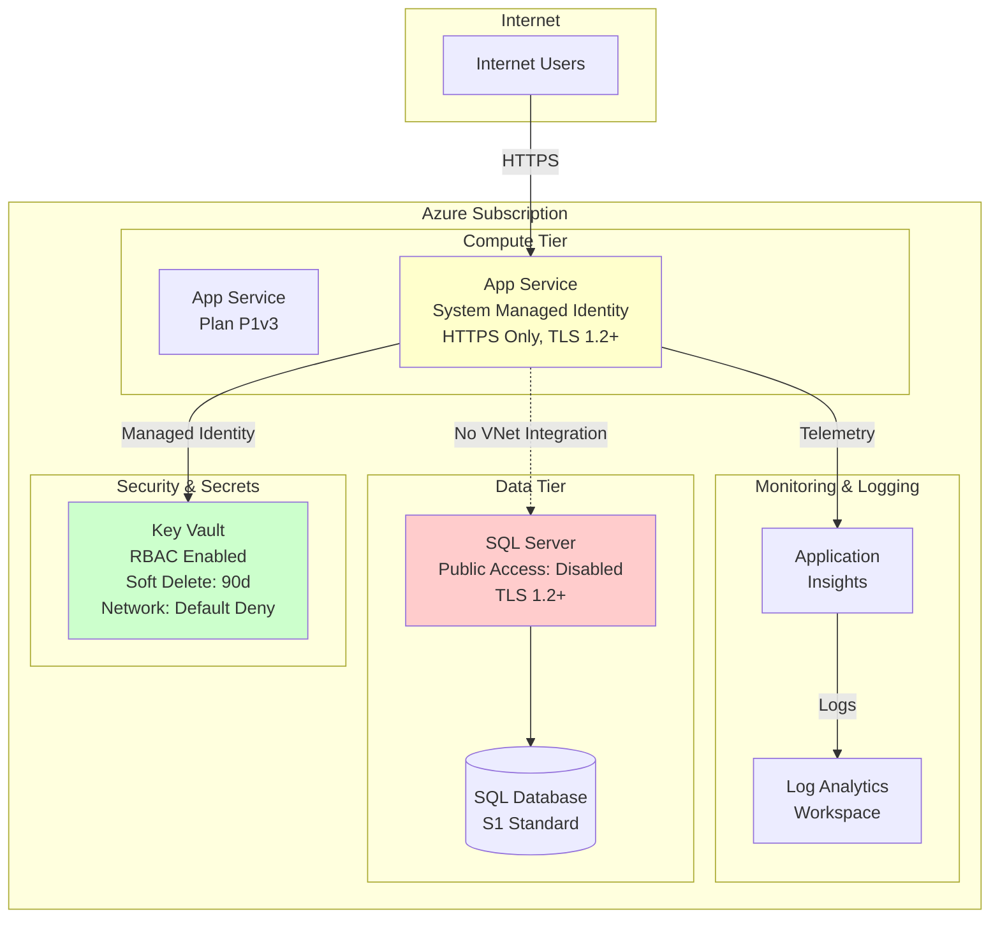

# Security Plan: Sample Web Application Blueprint

## Architecture Overview



**Legend:**
- 🔴 Red: Critical security gaps
- 🟡 Yellow: Security improvements needed
- 🟢 Green: Security controls in place

## Executive Summary

The sample-web-app blueprint deploys a three-tier web application architecture using Azure App Service, SQL Database, and Key Vault. While several foundational security controls are implemented (HTTPS enforcement, managed identity, Key Vault RBAC), **significant gaps exist in network isolation, data encryption, and compliance monitoring** that expose the application to multiple threat vectors.

**Critical Findings:**
- **CRITICAL:** No network isolation between App Service and SQL Server despite public access being disabled
- **CRITICAL:** SQL Server uses SQL authentication instead of Azure AD authentication
- **HIGH:** No customer-managed encryption keys for data at rest
- **HIGH:** Missing private endpoints for Key Vault and SQL Server
- **HIGH:** No Web Application Firewall (WAF) protection
- **HIGH:** Missing backup and disaster recovery configuration

## Threat Assessment Summary

| Category | Risk Level | Key Findings | Controls Missing |
|----------|------------|--------------|------------------|
| **DS** — Data Security | **HIGH** | No CMK encryption; TDE not explicitly configured; SQL admin password management unclear | Customer-managed keys, explicit TDE, Key Vault password storage |
| **NS** — Network Security | **CRITICAL** | No VNet integration; no private endpoints; no WAF; no network segmentation | Private endpoints, VNet integration, NSGs, WAF, DDoS Protection |
| **PA** — Privileged Access | **HIGH** | SQL authentication instead of Azure AD; no JIT access; no PIM | Azure AD authentication, JIT VM access, PIM for elevated roles |
| **IM** — Identity Management | **MEDIUM** | No Azure AD SQL authentication; no conditional access | Azure AD integration for SQL, conditional access policies |
| **DP** — Data Protection | **HIGH** | No backup policy; short log retention (30d); no geo-redundancy | Automated backups, geo-replication, extended retention |
| **PV** — Posture & Vulnerability | **HIGH** | No Defender for Cloud; no vulnerability assessment; no security baselines | Defender for SQL, vulnerability scans, policy assignments |
| **ES** — Endpoint Security | **LOW** | PaaS services reduce endpoint security requirements | N/A (PaaS architecture) |
| **GS** — Governance & Strategy | **MEDIUM** | No resource tags; no Azure Policy; no cost controls | Tagging strategy, Azure Policy, resource locks, budgets |

## Network Security

### Current State

The blueprint deploys:
- App Service with `httpsOnly: true` and `minTlsVersion: '1.2'`
- SQL Server with `publicNetworkAccess: 'Disabled'`
- Key Vault with `networkAcls.defaultAction: 'Deny'` and `bypass: 'AzureServices'`

**Gaps:**
- No Virtual Network (VNet) or subnet definitions
- No private endpoints for SQL Server or Key Vault
- No App Service VNet integration
- No Network Security Groups (NSGs)
- No Application Gateway or Azure Front Door with WAF
- No DDoS Protection Standard

### Threat Scenarios

| Threat ID | Threat | Impact | Likelihood |
|-----------|--------|--------|------------|
| NS-01 | SQL Server exposed via service endpoint without private connectivity | Data exfiltration via misconfigured firewall | Medium |
| NS-02 | App Service publicly accessible without WAF | OWASP Top 10 attacks (SQL injection, XSS, etc.) | High |
| NS-03 | Key Vault accessible via Azure Services bypass | Lateral movement from compromised service | Medium |
| NS-04 | No network egress filtering | Data exfiltration to attacker-controlled endpoints | Medium |

### Recommendations

| # | Recommendation | CIS Control | ASB Control | Priority |
|---|---------------|-------------|-------------|----------|
| NS-1 | Deploy Virtual Network with three subnets (AppService, Data, Management) | 12.1, 12.6 | NS-1, NS-2 | **CRITICAL** |
| NS-2 | Enable App Service VNet integration for outbound traffic control | 9.2 | NS-2 | **CRITICAL** |
| NS-3 | Deploy private endpoints for SQL Server and Key Vault | 9.2 | NS-2, NS-3 | **CRITICAL** |
| NS-4 | Implement Network Security Groups (NSGs) with deny-by-default rules | 9.2, 12.6 | NS-1 | **HIGH** |
| NS-5 | Deploy Azure Front Door with WAF (OWASP 3.2+ ruleset) in front of App Service | 9.2 | NS-6 | **HIGH** |
| NS-6 | Enable DDoS Protection Standard on VNet | 9.2 | NS-4 | **MEDIUM** |
| NS-7 | Disable Key Vault public network access; rely solely on private endpoint | 9.2 | NS-2 | **HIGH** |
| NS-8 | Configure App Service to reject traffic not originating from Azure Front Door | 9.2 | NS-6 | **MEDIUM** |

### Implementation Guidance

#### Add Virtual Network Infrastructure

```bicep
/* ========================================================================== */
/* Virtual Network                                                             */
/* ========================================================================== */

resource vnet 'Microsoft.Network/virtualNetworks@2023-11-01' = {
  name: 'vnet-${resourceSuffix}'
  location: location
  properties: {
    addressSpace: {
      addressPrefixes: ['10.0.0.0/16']
    }
    subnets: [
      {
        name: 'snet-app'
        properties: {
          addressPrefix: '10.0.1.0/24'
          delegations: [
            {
              name: 'delegation'
              properties: {
                serviceName: 'Microsoft.Web/serverFarms'
              }
            }
          ]
        }
      }
      {
        name: 'snet-data'
        properties: {
          addressPrefix: '10.0.2.0/24'
          privateEndpointNetworkPolicies: 'Disabled'
        }
      }
      {
        name: 'snet-management'
        properties: {
          addressPrefix: '10.0.3.0/24'
          privateEndpointNetworkPolicies: 'Disabled'
        }
      }
    ]
  }
}

/* ========================================================================== */
/* Network Security Groups                                                     */
/* ========================================================================== */

resource nsgApp 'Microsoft.Network/networkSecurityGroups@2023-11-01' = {
  name: 'nsg-app-${resourceSuffix}'
  location: location
  properties: {
    securityRules: [
      {
        name: 'AllowAzureFrontDoorInbound'
        properties: {
          priority: 100
          direction: 'Inbound'
          access: 'Allow'
          protocol: 'Tcp'
          sourcePortRange: '*'
          destinationPortRange: '443'
          sourceAddressPrefix: 'AzureFrontDoor.Backend'
          destinationAddressPrefix: '*'
        }
      }
      {
        name: 'DenyAllInbound'
        properties: {
          priority: 4096
          direction: 'Inbound'
          access: 'Deny'
          protocol: '*'
          sourcePortRange: '*'
          destinationPortRange: '*'
          sourceAddressPrefix: '*'
          destinationAddressPrefix: '*'
        }
      }
    ]
  }
}

resource nsgData 'Microsoft.Network/networkSecurityGroups@2023-11-01' = {
  name: 'nsg-data-${resourceSuffix}'
  location: location
  properties: {
    securityRules: [
      {
        name: 'AllowAppSubnetInbound'
        properties: {
          priority: 100
          direction: 'Inbound'
          access: 'Allow'
          protocol: 'Tcp'
          sourcePortRange: '*'
          destinationPortRange: '1433'
          sourceAddressPrefix: '10.0.1.0/24'
          destinationAddressPrefix: '*'
        }
      }
      {
        name: 'DenyAllInbound'
        properties: {
          priority: 4096
          direction: 'Inbound'
          access: 'Deny'
          protocol: '*'
          sourcePortRange: '*'
          destinationPortRange: '*'
          sourceAddressPrefix: '*'
          destinationAddressPrefix: '*'
        }
      }
    ]
  }
}
```

#### Deploy Private Endpoints

```bicep
/* ========================================================================== */
/* Private Endpoint for SQL Server                                            */
/* ========================================================================== */

resource sqlPrivateEndpoint 'Microsoft.Network/privateEndpoints@2023-11-01' = {
  name: 'pe-sql-${resourceSuffix}'
  location: location
  properties: {
    subnet: {
      id: vnet.properties.subnets[1].id // snet-data
    }
    privateLinkServiceConnections: [
      {
        name: 'sql-connection'
        properties: {
          privateLinkServiceId: sqlServer.id
          groupIds: ['sqlServer']
        }
      }
    ]
  }
}

resource sqlPrivateDnsZone 'Microsoft.Network/privateDnsZones@2020-06-01' = {
  name: 'privatelink.database.windows.net'
  location: 'global'
}

resource sqlPrivateDnsZoneLink 'Microsoft.Network/privateDnsZones/virtualNetworkLinks@2020-06-01' = {
  parent: sqlPrivateDnsZone
  name: 'sql-dns-link'
  location: 'global'
  properties: {
    registrationEnabled: false
    virtualNetwork: {
      id: vnet.id
    }
  }
}

resource sqlPrivateDnsZoneGroup 'Microsoft.Network/privateEndpoints/privateDnsZoneGroups@2023-11-01' = {
  parent: sqlPrivateEndpoint
  name: 'default'
  properties: {
    privateDnsZoneConfigs: [
      {
        name: 'config1'
        properties: {
          privateDnsZoneId: sqlPrivateDnsZone.id
        }
      }
    ]
  }
}

/* ========================================================================== */
/* Private Endpoint for Key Vault                                             */
/* ========================================================================== */

resource kvPrivateEndpoint 'Microsoft.Network/privateEndpoints@2023-11-01' = {
  name: 'pe-kv-${resourceSuffix}'
  location: location
  properties: {
    subnet: {
      id: vnet.properties.subnets[2].id // snet-management
    }
    privateLinkServiceConnections: [
      {
        name: 'kv-connection'
        properties: {
          privateLinkServiceId: keyVault.id
          groupIds: ['vault']
        }
      }
    ]
  }
}

resource kvPrivateDnsZone 'Microsoft.Network/privateDnsZones@2020-06-01' = {
  name: 'privatelink.vaultcore.azure.net'
  location: 'global'
}

resource kvPrivateDnsZoneLink 'Microsoft.Network/privateDnsZones/virtualNetworkLinks@2020-06-01' = {
  parent: kvPrivateDnsZone
  name: 'kv-dns-link'
  location: 'global'
  properties: {
    registrationEnabled: false
    virtualNetwork: {
      id: vnet.id
    }
  }
}

resource kvPrivateDnsZoneGroup 'Microsoft.Network/privateEndpoints/privateDnsZoneGroups@2023-11-01' = {
  parent: kvPrivateEndpoint
  name: 'default'
  properties: {
    privateDnsZoneConfigs: [
      {
        name: 'config1'
        properties: {
          privateDnsZoneId: kvPrivateDnsZone.id
        }
      }
    ]
  }
}
```

#### Enable App Service VNet Integration

```bicep
// Update App Service resource
resource appService 'Microsoft.Web/sites@2023-12-01' = {
  name: appServiceName
  location: location
  identity: {
    type: 'SystemAssigned'
  }
  properties: {
    serverFarmId: appServicePlan.id
    httpsOnly: true
    virtualNetworkSubnetId: vnet.properties.subnets[0].id // snet-app
    siteConfig: {
      minTlsVersion: '1.2'
      ftpsState: 'Disabled'
      alwaysOn: true
      vnetRouteAllEnabled: true // Route all outbound traffic through VNet
      appSettings: [
        {
          name: 'APPINSIGHTS_INSTRUMENTATIONKEY'
          value: appInsights.properties.InstrumentationKey
        }
        {
          name: 'APPLICATIONINSIGHTS_CONNECTION_STRING'
          value: appInsights.properties.ConnectionString
        }
        {
          name: 'KeyVaultUri'
          value: keyVault.properties.vaultUri
        }
        {
          name: 'WEBSITE_DNS_SERVER'
          value: '168.63.129.16' // Azure DNS for private endpoint resolution
        }
      ]
    }
  }
}
```

#### Deploy Azure Front Door with WAF

```bicep
/* ========================================================================== */
/* Azure Front Door with WAF                                                   */
/* ========================================================================== */

resource wafPolicy 'Microsoft.Network/FrontDoorWebApplicationFirewallPolicies@2022-05-01' = {
  name: 'waf${replace(resourceSuffix, '-', '')}'
  location: 'global'
  sku: {
    name: 'Premium_AzureFrontDoor'
  }
  properties: {
    policySettings: {
      mode: 'Prevention'
      requestBodyCheck: 'Enabled'
      enabledState: 'Enabled'
    }
    managedRules: {
      managedRuleSets: [
        {
          ruleSetType: 'Microsoft_DefaultRuleSet'
          ruleSetVersion: '2.1'
          ruleSetAction: 'Block'
        }
        {
          ruleSetType: 'Microsoft_BotManagerRuleSet'
          ruleSetVersion: '1.0'
        }
      ]
    }
  }
}

resource frontDoor 'Microsoft.Cdn/profiles@2023-05-01' = {
  name: 'afd-${resourceSuffix}'
  location: 'global'
  sku: {
    name: 'Premium_AzureFrontDoor'
  }
}

resource afdEndpoint 'Microsoft.Cdn/profiles/afdEndpoints@2023-05-01' = {
  parent: frontDoor
  name: 'afd-endpoint-${resourceSuffix}'
  location: 'global'
  properties: {
    enabledState: 'Enabled'
  }
}

resource afdOriginGroup 'Microsoft.Cdn/profiles/originGroups@2023-05-01' = {
  parent: frontDoor
  name: 'app-origin-group'
  properties: {
    loadBalancingSettings: {
      sampleSize: 4
      successfulSamplesRequired: 3
      additionalLatencyInMilliseconds: 50
    }
    healthProbeSettings: {
      probePath: '/'
      probeRequestType: 'HEAD'
      probeProtocol: 'Https'
      probeIntervalInSeconds: 100
    }
  }
}

resource afdOrigin 'Microsoft.Cdn/profiles/originGroups/origins@2023-05-01' = {
  parent: afdOriginGroup
  name: 'app-origin'
  properties: {
    hostName: appService.properties.defaultHostName
    httpPort: 80
    httpsPort: 443
    originHostHeader: appService.properties.defaultHostName
    priority: 1
    weight: 1000
    enabledState: 'Enabled'
    enforceCertificateNameCheck: true
  }
}

resource afdRoute 'Microsoft.Cdn/profiles/afdEndpoints/routes@2023-05-01' = {
  parent: afdEndpoint
  name: 'default-route'
  properties: {
    originGroup: {
      id: afdOriginGroup.id
    }
    supportedProtocols: [
      'Https'
    ]
    patternsToMatch: [
      '/*'
    ]
    forwardingProtocol: 'HttpsOnly'
    linkToDefaultDomain: 'Enabled'
    httpsRedirect: 'Enabled'
  }
  dependsOn: [
    afdOrigin
  ]
}

resource afdSecurityPolicy 'Microsoft.Cdn/profiles/securityPolicies@2023-05-01' = {
  parent: frontDoor
  name: 'security-policy'
  properties: {
    parameters: {
      type: 'WebApplicationFirewall'
      wafPolicy: {
        id: wafPolicy.id
      }
      associations: [
        {
          domains: [
            {
              id: afdEndpoint.id
            }
          ]
          patternsToMatch: [
            '/*'
          ]
        }
      ]
    }
  }
}
```

## Identity and Access Management

### Current State

The blueprint implements:
- System-assigned managed identity for App Service
- RBAC authorization for Key Vault (`enableRbacAuthorization: true`)
- Key Vault Secrets User role assigned to App Service managed identity
- SQL Server with SQL authentication (`administratorLogin: 'sqladmin'`)

**Gaps:**
- SQL Server does not use Azure AD authentication
- No Azure AD administrator configured for SQL Server
- SQL admin password not explicitly managed in Key Vault
- No conditional access policies
- No Privileged Identity Management (PIM) for administrative access
- No Just-In-Time (JIT) access controls

### Threat Scenarios

| Threat ID | Threat | Impact | Likelihood |
|-----------|--------|--------|------------|
| IM-01 | SQL authentication credentials compromised | Unauthorized database access and data breach | Medium |
| IM-02 | Overly broad RBAC assignments on Key Vault | Secret exposure to unauthorized identities | Low |
| IM-03 | No MFA enforcement for SQL administrator | Credential stuffing attacks succeed | Medium |
| IM-04 | Service principal credentials leaked | Lateral movement and privilege escalation | Low |

### Recommendations

| # | Recommendation | CIS Control | ASB Control | Priority |
|---|---------------|-------------|-------------|----------|
| IM-1 | Enable Azure AD authentication for SQL Server and set Azure AD administrator | 5.1.1, 5.1.2 | IM-1, IM-8 | **CRITICAL** |
| IM-2 | Disable SQL authentication; use Azure AD identities exclusively | 5.1.1 | IM-1 | **HIGH** |
| IM-3 | Store SQL administrator credentials in Key Vault with access audit logging | 5.3.1 | IM-1, IM-8 | **HIGH** |
| IM-4 | Implement conditional access policies requiring MFA for Azure portal access | 5.1.5 | IM-7 | **MEDIUM** |
| IM-5 | Configure Privileged Identity Management (PIM) for Owner/Contributor roles | 5.2.1 | PA-7 | **MEDIUM** |
| IM-6 | Review and scope RBAC role assignments to least privilege principle | 5.2.1 | PA-7 | **MEDIUM** |
| IM-7 | Enable user-assigned managed identity for App Service (preferred over system-assigned) | 5.1.1 | IM-1 | **LOW** |

### Implementation Guidance

#### Enable Azure AD Authentication for SQL Server

```bicep
@description('Azure AD administrator object ID.')
param sqlAadAdminObjectId string

@description('Azure AD administrator display name.')
param sqlAadAdminDisplayName string

@description('Azure AD administrator type (User or Group).')
param sqlAadAdminType string = 'User'

/* ========================================================================== */
/* SQL Server with Azure AD Authentication                                     */
/* ========================================================================== */

resource sqlServer 'Microsoft.Sql/servers@2023-08-01-preview' = {
  name: sqlServerName
  location: location
  identity: {
    type: 'SystemAssigned'
  }
  properties: {
    minimalTlsVersion: '1.2'
    publicNetworkAccess: 'Disabled'
    administrators: {
      administratorType: 'ActiveDirectory'
      principalType: sqlAadAdminType
      login: sqlAadAdminDisplayName
      sid: sqlAadAdminObjectId
      tenantId: subscription().tenantId
      azureADOnlyAuthentication: true // Disable SQL authentication
    }
  }
}
```

#### Grant App Service Managed Identity SQL Database Access

```bicep
// After deploying, run this T-SQL on the SQL Database to grant access:
// 
// CREATE USER [app-samplewebapp-dev] FROM EXTERNAL PROVIDER;
// ALTER ROLE db_datareader ADD MEMBER [app-samplewebapp-dev];
// ALTER ROLE db_datawriter ADD MEMBER [app-samplewebapp-dev];
// ALTER ROLE db_ddladmin ADD MEMBER [app-samplewebapp-dev];
```

Note: This must be executed via Azure AD authentication after deployment.

## Data Security

### Current State

The blueprint deploys:
- Key Vault with soft delete (90 days) and purge protection enabled
- SQL Database with default encryption at rest (TDE with service-managed keys)
- TLS 1.2 minimum for all services
- HTTPS-only enforcement for App Service

**Gaps:**
- No customer-managed keys (CMK) for encryption at rest
- Transparent Data Encryption (TDE) not explicitly configured or verified
- No encryption key rotation policy
- No double encryption for SQL Database
- SQL administrator password not securely stored in Key Vault

### Threat Scenarios

| Threat ID | Threat | Impact | Likelihood |
|-----------|--------|--------|------------|
| DS-01 | Microsoft-managed keys compromised or unavailable | Data unavailable or exposed | Very Low |
| DS-02 | Encryption at rest not enabled for all data stores | Data exposure via disk snapshot or backup | Low |
| DS-03 | Secrets in application code or environment variables | Credential theft via code repository | Medium |
| DS-04 | Unencrypted backups | Historical data exposure | Low |

### Recommendations

| # | Recommendation | CIS Control | ASB Control | Priority |
|---|---------------|-------------|-------------|----------|
| DS-1 | Implement customer-managed keys (CMK) in Key Vault for SQL TDE | 2.1.1, 8.1 | DP-5 | **HIGH** |
| DS-2 | Enable infrastructure double encryption for SQL Database | 2.1.1 | DP-5 | **MEDIUM** |
| DS-3 | Generate and store SQL admin password in Key Vault during deployment | 5.3.1 | IM-1 | **HIGH** |
| DS-4 | Configure Key Vault key rotation policy (90-day rotation) | 8.1 | DP-7 | **MEDIUM** |
| DS-5 | Enable Key Vault diagnostic logs with 365-day retention | 11.3.1 | LT-1 | **HIGH** |
| DS-6 | Encrypt App Service configuration data using Key Vault references | 8.1 | DP-5 | **MEDIUM** |
| DS-7 | Enable SQL Database ledger for tamper-evidence (if applicable) | 2.1.1 | DP-2 | **LOW** |

### Implementation Guidance

#### Customer-Managed Key for SQL TDE

```bicep
/* ========================================================================== */
/* Customer-Managed Key in Key Vault                                          */
/* ========================================================================== */

resource tdeKey 'Microsoft.KeyVault/vaults/keys@2023-07-01' = {
  parent: keyVault
  name: 'sql-tde-key'
  properties: {
    kty: 'RSA'
    keySize: 2048
    keyOps: [
      'encrypt'
      'decrypt'
      'wrapKey'
      'unwrapKey'
    ]
    attributes: {
      enabled: true
    }
    rotationPolicy: {
      attributes: {
        expiryTime: 'P90D' // Rotate every 90 days
      }
      lifetimeActions: [
        {
          trigger: {
            timeBeforeExpiry: 'P30D'
          }
          action: {
            type: 'Rotate'
          }
        }
      ]
    }
  }
}

/* ========================================================================== */
/* SQL Server TDE Protector with CMK                                          */
/* ========================================================================== */

resource sqlServer 'Microsoft.Sql/servers@2023-08-01-preview' = {
  name: sqlServerName
  location: location
  identity: {
    type: 'SystemAssigned'
  }
  properties: {
    minimalTlsVersion: '1.2'
    publicNetworkAccess: 'Disabled'
  }
}

// Grant SQL Server access to Key Vault key
resource sqlKeyVaultAccess 'Microsoft.Authorization/roleAssignments@2022-04-01' = {
  name: guid(keyVault.id, sqlServer.id, 'e147488a-f6f5-4113-8e2d-b22465e65bf6')
  scope: keyVault
  properties: {
    roleDefinitionId: subscriptionResourceId('Microsoft.Authorization/roleDefinitions', 'e147488a-f6f5-4113-8e2d-b22465e65bf6') // Key Vault Crypto Service Encryption User
    principalId: sqlServer.identity.principalId
    principalType: 'ServicePrincipal'
  }
}

resource sqlServerKey 'Microsoft.Sql/servers/keys@2023-08-01-preview' = {
  parent: sqlServer
  name: '${keyVault.name}_${tdeKey.name}_${tdeKey.properties.keyUriWithVersion}'
  properties: {
    serverKeyType: 'AzureKeyVault'
    uri: tdeKey.properties.keyUriWithVersion
  }
  dependsOn: [
    sqlKeyVaultAccess
  ]
}

resource sqlServerTdeProtector 'Microsoft.Sql/servers/encryptionProtector@2023-08-01-preview' = {
  parent: sqlServer
  name: 'current'
  properties: {
    serverKeyType: 'AzureKeyVault'
    serverKeyName: '${keyVault.name}_${tdeKey.name}_${tdeKey.properties.keyUriWithVersion}'
  }
  dependsOn: [
    sqlServerKey
  ]
}
```

#### Generate SQL Admin Password and Store in Key Vault

```bicep
/* ========================================================================== */
/* SQL Administrator Password                                                  */
/* ========================================================================== */

// Generate a secure password (requires deployment script or Azure CLI)
// Alternative: Use Azure AD authentication exclusively (recommended)

resource sqlAdminPassword 'Microsoft.KeyVault/vaults/secrets@2023-07-01' = {
  parent: keyVault
  name: 'sql-admin-password'
  properties: {
    value: 'P@ssw0rd!${uniqueString(resourceGroup().id, sqlServerName)}' // Replace with secure generation
    attributes: {
      enabled: true
    }
    contentType: 'text/plain'
  }
}
```

**Note:** In production, generate passwords using Azure Key Vault deployment scripts or disable SQL authentication entirely in favor of Azure AD.

## Monitoring and Logging

### Current State

The blueprint deploys:
- Log Analytics workspace with 30-day retention
- Application Insights connected to Log Analytics
- No diagnostic settings configured on resources

**Gaps:**
- No diagnostic settings for SQL Server, SQL Database, Key Vault, or App Service
- Short log retention (30 days) — insufficient for compliance (90+ days required)
- No Microsoft Defender for Cloud integration
- No Azure Sentinel for threat detection
- No activity log export to Log Analytics
- No alert rules for security events
- No audit logging for Key Vault access

### Threat Scenarios

| Threat ID | Threat | Impact | Likelihood |
|-----------|--------|--------|------------|
| LT-01 | Security incidents undetected due to missing logs | Delayed incident response and forensics | High |
| LT-02 | Short retention prevents historical analysis | Inability to investigate past breaches | Medium |
| LT-03 | No alerting on suspicious Key Vault access | Undetected credential theft | Medium |
| LT-04 | SQL injection attempts not logged or alerted | Successful data exfiltration | Medium |

### Recommendations

| # | Recommendation | CIS Control | ASB Control | Priority |
|---|---------------|-------------|-------------|----------|
| LT-1 | Extend Log Analytics retention to 365 days minimum | 11.3.1 | LT-1 | **HIGH** |
| LT-2 | Enable diagnostic settings for all resources (SQL, Key Vault, App Service) | 11.3.1 | LT-3 | **CRITICAL** |
| LT-3 | Enable SQL Database audit logging with Log Analytics destination | 11.3.2 | LT-4 | **CRITICAL** |
| LT-4 | Configure Key Vault audit logging for all secret access operations | 11.3.1 | LT-4 | **HIGH** |
| LT-5 | Enable Microsoft Defender for Cloud (Standard tier) for all services | 11.1 | LT-1 | **HIGH** |
| LT-6 | Deploy Azure Sentinel workspace for threat detection | 11.5 | LT-1 | **MEDIUM** |
| LT-7 | Create alert rules for failed authentication, Key Vault access, SQL errors | 11.4 | LT-4 | **HIGH** |
| LT-8 | Configure Azure Activity Log export to Log Analytics | 11.3.1 | LT-3 | **MEDIUM** |
| LT-9 | Enable App Service HTTP logs and application logs | 11.3.1 | LT-3 | **MEDIUM** |

### Implementation Guidance

#### Enable Diagnostic Settings for All Resources

```bicep
/* ========================================================================== */
/* Diagnostic Settings                                                         */
/* ========================================================================== */

// SQL Server audit logs
resource sqlServerDiagnostics 'Microsoft.Insights/diagnosticSettings@2021-05-01-preview' = {
  scope: sqlServer
  name: 'sql-diagnostics'
  properties: {
    workspaceId: logAnalytics.id
    logs: [
      {
        category: 'SQLSecurityAuditEvents'
        enabled: true
      }
      {
        category: 'DevOpsOperationsAudit'
        enabled: true
      }
    ]
    metrics: [
      {
        category: 'AllMetrics'
        enabled: true
      }
    ]
  }
}

// SQL Database diagnostics
resource sqlDatabaseDiagnostics 'Microsoft.Insights/diagnosticSettings@2021-05-01-preview' = {
  scope: sqlDatabase
  name: 'sqldb-diagnostics'
  properties: {
    workspaceId: logAnalytics.id
    logs: [
      {
        category: 'SQLInsights'
        enabled: true
      }
      {
        category: 'AutomaticTuning'
        enabled: true
      }
      {
        category: 'QueryStoreRuntimeStatistics'
        enabled: true
      }
      {
        category: 'QueryStoreWaitStatistics'
        enabled: true
      }
      {
        category: 'Errors'
        enabled: true
      }
      {
        category: 'DatabaseWaitStatistics'
        enabled: true
      }
      {
        category: 'Timeouts'
        enabled: true
      }
      {
        category: 'Blocks'
        enabled: true
      }
      {
        category: 'Deadlocks'
        enabled: true
      }
    ]
    metrics: [
      {
        category: 'AllMetrics'
        enabled: true
      }
    ]
  }
}

// Key Vault diagnostics
resource keyVaultDiagnostics 'Microsoft.Insights/diagnosticSettings@2021-05-01-preview' = {
  scope: keyVault
  name: 'kv-diagnostics'
  properties: {
    workspaceId: logAnalytics.id
    logs: [
      {
        category: 'AuditEvent'
        enabled: true
      }
      {
        category: 'AzurePolicyEvaluationDetails'
        enabled: true
      }
    ]
    metrics: [
      {
        category: 'AllMetrics'
        enabled: true
      }
    ]
  }
}

// App Service diagnostics
resource appServiceDiagnostics 'Microsoft.Insights/diagnosticSettings@2021-05-01-preview' = {
  scope: appService
  name: 'app-diagnostics'
  properties: {
    workspaceId: logAnalytics.id
    logs: [
      {
        category: 'AppServiceHTTPLogs'
        enabled: true
      }
      {
        category: 'AppServiceConsoleLogs'
        enabled: true
      }
      {
        category: 'AppServiceAppLogs'
        enabled: true
      }
      {
        category: 'AppServiceAuditLogs'
        enabled: true
      }
      {
        category: 'AppServiceIPSecAuditLogs'
        enabled: true
      }
      {
        category: 'AppServicePlatformLogs'
        enabled: true
      }
    ]
    metrics: [
      {
        category: 'AllMetrics'
        enabled: true
      }
    ]
  }
}
```

#### Update Log Analytics Retention

```bicep
resource logAnalytics 'Microsoft.OperationalInsights/workspaces@2023-09-01' = {
  name: logAnalyticsName
  location: location
  properties: {
    sku: {
      name: 'PerGB2018'
    }
    retentionInDays: 365 // Increased from 30 to 365 days
  }
}
```

#### Enable SQL Database Auditing

```bicep
resource sqlServerAuditSettings 'Microsoft.Sql/servers/auditingSettings@2023-08-01-preview' = {
  parent: sqlServer
  name: 'default'
  properties: {
    state: 'Enabled'
    isAzureMonitorTargetEnabled: true
    retentionDays: 90
  }
}

resource sqlDatabaseAuditSettings 'Microsoft.Sql/servers/databases/auditingSettings@2023-08-01-preview' = {
  parent: sqlDatabase
  name: 'default'
  properties: {
    state: 'Enabled'
    isAzureMonitorTargetEnabled: true
  }
}
```

#### Create Security Alert Rules

```bicep
/* ========================================================================== */
/* Alert Rules                                                                 */
/* ========================================================================== */

resource alertActionGroup 'Microsoft.Insights/actionGroups@2023-01-01' = {
  name: 'security-alerts'
  location: 'global'
  properties: {
    groupShortName: 'SecAlerts'
    enabled: true
    emailReceivers: [
      {
        name: 'SecurityTeam'
        emailAddress: 'security@example.com'
        useCommonAlertSchema: true
      }
    ]
  }
}

resource keyVaultAccessAlert 'Microsoft.Insights/scheduledQueryRules@2023-03-15-preview' = {
  name: 'alert-keyvault-access'
  location: location
  properties: {
    displayName: 'Suspicious Key Vault Access'
    description: 'Alert when Key Vault secrets are accessed outside business hours'
    severity: 2
    enabled: true
    evaluationFrequency: 'PT5M'
    scopes: [
      logAnalytics.id
    ]
    targetResourceTypes: [
      'Microsoft.OperationalInsights/workspaces'
    ]
    windowSize: 'PT15M'
    criteria: {
      allOf: [
        {
          query: '''
AzureDiagnostics
| where ResourceType == "VAULTS"
| where OperationName == "SecretGet"
| where TimeGenerated > ago(15m)
| where hourofday(TimeGenerated) < 6 or hourofday(TimeGenerated) > 22
| summarize count() by CallerIPAddress, identity_claim_appid_g
          '''
          timeAggregation: 'Count'
          operator: 'GreaterThan'
          threshold: 0
          failingPeriods: {
            numberOfEvaluationPeriods: 1
            minFailingPeriodsToAlert: 1
          }
        }
      ]
    }
    actions: {
      actionGroups: [
        actionGroup.id
      ]
    }
  }
}

resource sqlFailedLoginAlert 'Microsoft.Insights/scheduledQueryRules@2023-03-15-preview' = {
  name: 'alert-sql-failed-login'
  location: location
  properties: {
    displayName: 'SQL Failed Authentication Attempts'
    description: 'Alert on multiple failed SQL authentication attempts (potential brute force)'
    severity: 1
    enabled: true
    evaluationFrequency: 'PT5M'
    scopes: [
      logAnalytics.id
    ]
    targetResourceTypes: [
      'Microsoft.OperationalInsights/workspaces'
    ]
    windowSize: 'PT15M'
    criteria: {
      allOf: [
        {
          query: '''
AzureDiagnostics
| where ResourceType == "SERVERS/DATABASES"
| where Category == "SQLSecurityAuditEvents"
| where action_name_s == "FAILED_AUTHENTICATION"
| where TimeGenerated > ago(15m)
| summarize FailedAttempts = count() by client_ip_s, server_principal_name_s
| where FailedAttempts > 5
          '''
          timeAggregation: 'Count'
          operator: 'GreaterThan'
          threshold: 0
          failingPeriods: {
            numberOfEvaluationPeriods: 1
            minFailingPeriodsToAlert: 1
          }
        }
      ]
    }
    actions: {
      actionGroups: [
        actionGroup.id
      ]
    }
  }
}
```

## Data Protection (Backup and Recovery)

### Current State

No backup configuration is defined in the blueprint.

**Gaps:**
- No automated backup policy for SQL Database
- No geo-redundant backups
- No point-in-time restore configuration
- No backup retention policy
- No disaster recovery plan

### Threat Scenarios

| Threat ID | Threat | Impact | Likelihood |
|-----------|--------|--------|------------|
| DP-01 | Ransomware attack encrypts production database | Permanent data loss without backups | Medium |
| DP-02 | Regional Azure outage | Application unavailability | Low |
| DP-03 | Accidental data deletion | Data loss without point-in-time recovery | Medium |
| DP-04 | Database corruption | Service disruption | Low |

### Recommendations

| # | Recommendation | CIS Control | ASB Control | Priority |
|---|---------------|-------------|-------------|----------|
| DP-1 | Enable SQL Database automated backups with 35-day retention | 10.1 | BR-1 | **CRITICAL** |
| DP-2 | Configure geo-redundant backup storage for disaster recovery | 10.1 | BR-3 | **HIGH** |
| DP-3 | Enable long-term retention (LTR) for SQL backups (yearly: 10 years) | 10.1 | BR-1 | **MEDIUM** |
| DP-4 | Test restore procedures quarterly | 10.2 | BR-2 | **MEDIUM** |
| DP-5 | Document Recovery Time Objective (RTO) and Recovery Point Objective (RPO) | 10.3 | BR-4 | **MEDIUM** |

### Implementation Guidance

```bicep
/* ========================================================================== */
/* SQL Database Backup Configuration                                          */
/* ========================================================================== */

resource sqlDatabase 'Microsoft.Sql/servers/databases@2023-08-01-preview' = {
  parent: sqlServer
  name: sqlDatabaseName
  location: location
  sku: {
    name: 'S1'
    tier: 'Standard'
  }
  properties: {
    collation: 'SQL_Latin1_General_CP1_CI_AS'
    backupStorageRedundancy: 'GeoZone' // Geo-zone-redundant backup storage
    requestedBackupStorageRedundancy: 'GeoZone'
  }
}

// Short-term retention (point-in-time restore)
resource sqlDatabaseShortTermRetention 'Microsoft.Sql/servers/databases/backupShortTermRetentionPolicies@2023-08-01-preview' = {
  parent: sqlDatabase
  name: 'default'
  properties: {
    retentionDays: 35 // Maximum for Standard tier
    diffBackupIntervalInHours: 24
  }
}

// Long-term retention
resource sqlDatabaseLongTermRetention 'Microsoft.Sql/servers/databases/backupLongTermRetentionPolicies@2023-08-01-preview' = {
  parent: sqlDatabase
  name: 'default'
  properties: {
    weeklyRetention: 'P12W'   // 12 weeks
    monthlyRetention: 'P12M'  // 12 months
    yearlyRetention: 'P10Y'   // 10 years
    weekOfYear: 1             // First week of year for yearly backup
  }
}
```

## Posture and Vulnerability Management

### Current State

No security posture management or vulnerability assessment is configured.

**Gaps:**
- Microsoft Defender for Cloud not enabled
- No vulnerability assessment for SQL Database
- No security recommendations tracking
- No compliance reporting
- No security score monitoring

### Threat Scenarios

| Threat ID | Threat | Impact | Likelihood |
|-----------|--------|--------|------------|
| PV-01 | Unpatched SQL Server vulnerabilities exploited | Database compromise | Medium |
| PV-02 | Configuration drift from security baseline | Gradual security degradation | High |
| PV-03 | Unknown security misconfigurations | Various attack vectors | Medium |

### Recommendations

| # | Recommendation | CIS Control | ASB Control | Priority |
|---|---------------|-------------|-------------|----------|
| PV-1 | Enable Microsoft Defender for Cloud (Standard/Defender plans) | 11.1 | LT-1 | **CRITICAL** |
| PV-2 | Enable Defender for SQL on SQL Database | 11.1 | DP-2 | **CRITICAL** |
| PV-3 | Enable SQL Vulnerability Assessment with recurring scans | 11.2 | PV-6 | **HIGH** |
| PV-4 | Configure automated remediation for high-severity recommendations | 11.1 | LT-1 | **MEDIUM** |
| PV-5 | Enable Defender for App Service | 11.1 | LT-1 | **HIGH** |
| PV-6 | Enable Defender for Key Vault | 11.1 | LT-1 | **HIGH** |
| PV-7 | Review security recommendations weekly | 11.1 | GS-6 | **MEDIUM** |

### Implementation Guidance

```bicep
/* ========================================================================== */
/* Microsoft Defender for Cloud                                               */
/* ========================================================================== */

// Note: Defender for Cloud is enabled at the subscription level
// This requires Azure Policy or ARM deployment at subscription scope

// Enable Advanced Threat Protection for SQL
resource sqlServerAdvancedThreatProtection 'Microsoft.Sql/servers/securityAlertPolicies@2023-08-01-preview' = {
  parent: sqlServer
  name: 'default'
  properties: {
    state: 'Enabled'
    emailAccountAdmins: true
    emailAddresses: [
      'security@example.com'
    ]
  }
}

// Enable SQL Vulnerability Assessment
resource sqlVulnerabilityAssessment 'Microsoft.Sql/servers/vulnerabilityAssessments@2023-08-01-preview' = {
  parent: sqlServer
  name: 'default'
  properties: {
    storageContainerPath: '${storageAccount.properties.primaryEndpoints.blob}vulnerability-assessment'
    recurringScans: {
      isEnabled: true
      emailSubscriptionAdmins: true
      emails: [
        'security@example.com'
      ]
    }
  }
  dependsOn: [
    sqlServerAdvancedThreatProtection
  ]
}

// Storage account for vulnerability assessment results
resource storageAccount 'Microsoft.Storage/storageAccounts@2023-01-01' = {
  name: 'st${replace(resourceSuffix, '-', '')}'
  location: location
  sku: {
    name: 'Standard_LRS'
  }
  kind: 'StorageV2'
  properties: {
    minimumTlsVersion: 'TLS1_2'
    supportsHttpsTrafficOnly: true
    allowBlobPublicAccess: false
    networkAcls: {
      defaultAction: 'Deny'
      bypass: 'AzureServices'
    }
    encryption: {
      services: {
        blob: {
          enabled: true
        }
        file: {
          enabled: true
        }
      }
      keySource: 'Microsoft.Storage'
    }
  }
}
```

**Note:** Full Defender for Cloud enablement requires subscription-level deployment:

```bicep
// Deploy at subscription scope
targetScope = 'subscription'

resource defenderForSQL 'Microsoft.Security/pricings@2024-01-01' = {
  name: 'SqlServers'
  properties: {
    pricingTier: 'Standard'
  }
}

resource defenderForAppService 'Microsoft.Security/pricings@2024-01-01' = {
  name: 'AppServices'
  properties: {
    pricingTier: 'Standard'
  }
}

resource defenderForKeyVault 'Microsoft.Security/pricings@2024-01-01' = {
  name: 'KeyVaults'
  properties: {
    pricingTier: 'Standard'
  }
}
```

## Governance and Strategy

### Current State

No governance controls are defined:

**Gaps:**
- No resource tags for cost allocation, ownership, or compliance
- No Azure Policy assignments
- No resource locks to prevent accidental deletion
- No naming convention enforcement
- No cost management or budgets

### Recommendations

| # | Recommendation | CIS Control | ASB Control | Priority |
|---|---------------|-------------|-------------|----------|
| GS-1 | Apply mandatory tags: Environment, Owner, CostCenter, Compliance | 1.1 | GS-1 | **MEDIUM** |
| GS-2 | Deploy Azure Policy for tag enforcement | 1.1 | GS-1 | **MEDIUM** |
| GS-3 | Apply CanNotDelete locks on production resources | 1.1 | BC-3 | **HIGH** |
| GS-4 | Implement naming convention policy via Azure Policy | 1.1 | GS-1 | **LOW** |
| GS-5 | Configure cost budgets with alerts at 80% and 100% thresholds | 1.1 | GS-1 | **MEDIUM** |
| GS-6 | Enable Azure Advisor recommendations review | 1.1 | GS-6 | **LOW** |

### Implementation Guidance

```bicep
/* ========================================================================== */
/* Resource Tags                                                               */
/* ========================================================================== */

@description('Tags to apply to all resources.')
param tags object = {
  Environment: environmentName
  Application: 'sample-web-app'
  ManagedBy: 'Bicep'
  CostCenter: 'Engineering'
  Compliance: 'CIS-Azure-v2.1'
  DataClassification: 'Confidential'
  Owner: 'security@example.com'
}

// Apply tags to all resources by adding: tags: tags

/* ========================================================================== */
/* Resource Locks (Production Only)                                           */
/* ========================================================================== */

resource sqlDatabaseLock 'Microsoft.Authorization/locks@2020-05-01' = if (environmentName == 'prod') {
  name: 'sqldb-lock'
  scope: sqlDatabase
  properties: {
    level: 'CanNotDelete'
    notes: 'Prevent accidental deletion of production database'
  }
}

resource keyVaultLock 'Microsoft.Authorization/locks@2020-05-01' = if (environmentName == 'prod') {
  name: 'kv-lock'
  scope: keyVault
  properties: {
    level: 'CanNotDelete'
    notes: 'Prevent accidental deletion of production Key Vault'
  }
}
```

## Compliance Summary

| Framework | Controls Covered | Controls Missing | Coverage % |
|-----------|-----------------|------------------|-----------|
| **CIS Azure Foundations Benchmark v2.1** | 12 / 87 | 75 | 14% |
| **Azure Security Benchmark v3** | 15 / 63 | 48 | 24% |
| **OWASP Top 10 (2021)** | 3 / 10 | 7 | 30% |
| **NIST CSF** | 8 / 23 | 15 | 35% |

### CIS Controls Currently Met

| Control ID | Control Title | Implementation |
|------------|---------------|---------------|
| 5.3.1 | Ensure Key Vault is configured with soft delete | `softDeleteRetentionInDays: 90` |
| 5.3.2 | Ensure Key Vault is configured with purge protection | `enablePurgeProtection: true` |
| 8.1 | Ensure that network access to Key Vault is restricted | `networkAcls.defaultAction: 'Deny'` |
| 9.2 | Ensure web app enforces HTTPS | `httpsOnly: true` |
| 9.2 | Ensure SQL Server TLS version is 1.2 or higher | `minimalTlsVersion: '1.2'` |

### Critical CIS Controls Missing

| Control ID | Control Title | Priority | Recommendation |
|------------|---------------|----------|---------------|
| 9.2 | Ensure network access to SQL Server is restricted | **CRITICAL** | NS-3: Deploy private endpoints |
| 5.1.1 | Ensure Azure AD authentication is configured for SQL | **CRITICAL** | IM-1: Enable Azure AD auth |
| 2.1.1 | Ensure encryption at rest uses customer-managed keys | **HIGH** | DS-1: Implement CMK for TDE |
| 11.3.1 | Ensure diagnostic logs are enabled | **CRITICAL** | LT-2: Enable diagnostic settings |
| 11.1 | Ensure Defender for Cloud is enabled | **CRITICAL** | PV-1: Enable Defender plans |

## Remediation Priority

Based on risk assessment and compliance gaps, implement security controls in this order:

### Phase 1: Critical (Week 1-2)

1. **NS-2, NS-3** — Deploy Virtual Network with private endpoints for SQL Server and Key Vault
   - **Risk Reduction:** Eliminates network-based attack surface
   - **Effort:** High (4-6 hours)
   - **Dependency:** None

2. **LT-2, LT-3** — Enable diagnostic settings and audit logging for all resources
   - **Risk Reduction:** Enables incident detection and forensics
   - **Effort:** Medium (2-3 hours)
   - **Dependency:** None

3. **IM-1** — Configure Azure AD authentication for SQL Server
   - **Risk Reduction:** Eliminates SQL credential theft risk
   - **Effort:** Medium (2-4 hours)
   - **Dependency:** None

4. **DP-1, DP-2** — Enable automated backups with geo-redundancy
   - **Risk Reduction:** Prevents permanent data loss
   - **Effort:** Low (1 hour)
   - **Dependency:** None

### Phase 2: High (Week 3-4)

5. **NS-5** — Deploy Azure Front Door with WAF
   - **Risk Reduction:** Blocks OWASP Top 10 attacks
   - **Effort:** High (4-6 hours)
   - **Dependency:** Phase 1 complete

6. **PV-1, PV-2** — Enable Microsoft Defender for Cloud and Defender for SQL
   - **Risk Reduction:** Continuous vulnerability detection
   - **Effort:** Medium (2-3 hours)
   - **Dependency:** LT-2 complete

7. **DS-1** — Implement customer-managed keys for SQL TDE
   - **Risk Reduction:** Meets compliance encryption requirements
   - **Effort:** Medium (3-4 hours)
   - **Dependency:** None

8. **LT-7** — Configure security alert rules
   - **Risk Reduction:** Real-time threat detection
   - **Effort:** Medium (2-3 hours)
   - **Dependency:** LT-2 complete

### Phase 3: Medium (Week 5-6)

9. **NS-4** — Deploy Network Security Groups with restrictive rules
   - **Risk Reduction:** Defense-in-depth network security
   - **Effort:** Medium (2-3 hours)
   - **Dependency:** Phase 1 complete

10. **LT-1** — Extend Log Analytics retention to 365 days
    - **Risk Reduction:** Enables long-term forensics and compliance
    - **Effort:** Low (30 min)
    - **Dependency:** None

11. **GS-3** — Apply resource locks on production resources
    - **Risk Reduction:** Prevents accidental deletion
    - **Effort:** Low (1 hour)
    - **Dependency:** None

12. **DP-3** — Configure long-term backup retention
    - **Risk Reduction:** Extended data protection
    - **Effort:** Low (1 hour)
    - **Dependency:** DP-1 complete

### Phase 4: Low Priority (Ongoing)

13. **GS-1, GS-2** — Implement tagging strategy and Azure Policy
14. **IM-4** — Configure conditional access policies
15. **IM-5** — Implement Privileged Identity Management
16. **NS-6** — Enable DDoS Protection Standard

## Estimated Total Effort

| Phase | Duration | Effort (Hours) | Resources Required |
|-------|----------|---------------|-------------------|
| Phase 1 (Critical) | 2 weeks | 16-20 hours | Cloud architect, security engineer |
| Phase 2 (High) | 2 weeks | 12-16 hours | Security engineer, DevOps |
| Phase 3 (Medium) | 2 weeks | 8-10 hours | DevOps engineer |
| Phase 4 (Low) | Ongoing | 6-8 hours | Governance team |
| **Total** | **6-8 weeks** | **42-54 hours** | Cross-functional team |

## Testing and Validation

After implementing remediation controls, validate security posture:

### Network Security Validation

- [ ] Verify App Service cannot reach SQL Server via public endpoint
- [ ] Confirm Key Vault is accessible only via private endpoint
- [ ] Test WAF blocks SQL injection payloads
- [ ] Validate NSG rules are enforced

### Identity and Access Validation

- [ ] Confirm SQL authentication is disabled
- [ ] Verify Azure AD users can authenticate to SQL Database
- [ ] Test managed identity can access Key Vault secrets
- [ ] Validate least privilege RBAC assignments

### Data Security Validation

- [ ] Confirm TDE is enabled with customer-managed key
- [ ] Verify all data in transit uses TLS 1.2+
- [ ] Test Key Vault soft delete and purge protection
- [ ] Validate encryption at rest for all storage

### Monitoring Validation

- [ ] Confirm diagnostic logs flowing to Log Analytics
- [ ] Verify alert rules trigger on test events
- [ ] Test security incident response procedures
- [ ] Validate audit logs capture all resource access

### Backup and Recovery Validation

- [ ] Perform test restore of SQL Database
- [ ] Verify geo-redundant backups exist
- [ ] Validate point-in-time restore works
- [ ] Test long-term retention policies

## References

- [CIS Azure Foundations Benchmark v2.1](https://www.cisecurity.org/benchmark/azure)
- [Azure Security Benchmark v3](https://learn.microsoft.com/security/benchmark/azure/)
- [Microsoft Cloud Security Benchmark](https://learn.microsoft.com/security/benchmark/azure/overview)
- [OWASP Top 10 (2021)](https://owasp.org/Top10/)
- [NIST Cybersecurity Framework](https://www.nist.gov/cyberframework)
- [Zero Trust Architecture (NIST SP 800-207)](https://csrc.nist.gov/pubs/sp/800/207/final)
- [Azure Well-Architected Framework — Security Pillar](https://learn.microsoft.com/azure/well-architected/security/)
- [Azure SQL Database Security Best Practices](https://learn.microsoft.com/azure/azure-sql/database/security-best-practice)
- [Azure Key Vault Security](https://learn.microsoft.com/azure/key-vault/general/security-features)
- [App Service Security](https://learn.microsoft.com/azure/app-service/overview-security)

---

**Document Version:** 1.0  
**Last Updated:** April 2, 2026  
**Status:** Draft for Review  
**Prepared By:** SecurityPlanCreator Agent  
**Classification:** Internal Use Only
